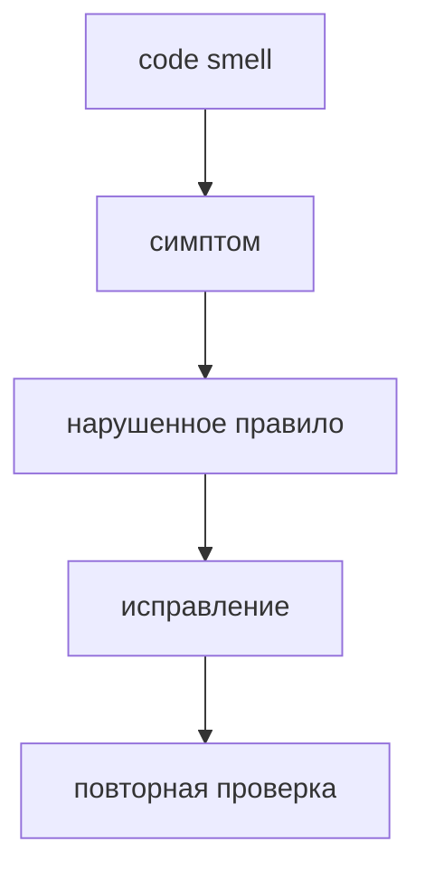

# Code smells

Статус: справочный нормативный документ



Эта страница фиксирует типовые признаки нарушения структуры FEOD. Smell не всегда означает немедленную ошибку в runtime, но означает архитектурный риск, который должен быть понятен в review, lint rules и AI rules.

Каждый smell описан одинаково:

- симптом - как нарушение выглядит в коде;
- почему проблема - какой контракт FEOD оно ломает;
- как исправить - куда двигать код или импорт;
- связанные правила - какие страницы задают норму.

## Deep imports

### Симптом

Код импортирует внутренний файл или внутреннюю директорию чужой FEOD-сущности:

```ts
import { OrderCard } from "@/modules/order/ui/OrderCard";
import { normalizeOrder } from "@/modules/order/lib/normalizeOrder";
import { formatMoney } from "@/common/format/lib/formatMoney";
```

### Почему проблема

Deep import обходит public API и делает внутреннюю структуру внешним контрактом. После этого нельзя безопасно переносить файлы, переименовывать helpers и менять внутренние директории: потребители уже зависят от деталей реализации.

### Как исправить

Импортируйте чужую FEOD-сущность только из корня её public API:

```ts
import { OrderCard, normalizeOrder } from "@/modules/order";
import { formatMoney } from "@/common/format";
```

Если нужного символа нет в public API, сначала решите, должен ли он быть публичным контрактом. Если да, добавьте явный export в корневый `index.ts`. Если нет, перепишите потребителя через существующий публичный сценарий.

### Связанные правила

- [Матрица импортов](./import-matrix.md)
- [Public API](./public-api.md)
- [Правила именования](./naming.md)

## Module internals leaking

### Симптом

Модуль экспортирует наружу приватные stores, selectors, DTO, raw clients, внутренние parts-компоненты или типы состояния:

```ts
// modules/user/index.ts
export { userStore } from "./model/userStore";
export { userClient } from "./api/userClient";
export type { UserCacheState } from "./model/internal-state";
```

### Почему проблема

Потребители начинают управлять внутренним состоянием модуля и знать его transport-детали. Public API перестаёт быть устойчивым контрактом и превращается в список файлов, которые оказались удобны снаружи.

### Как исправить

Оставьте в public API только поддерживаемые сценарии, компоненты и типы входа или выхода:

```ts
// modules/user/index.ts
export { UserMenu } from "./ui/UserMenu";
export { useCurrentUser } from "./model/useCurrentUser";
export type { User, UserId } from "./model/types";
```

Для внешнего кода открывайте устойчивую функцию, hook, компонент или adapter вместо внутреннего store, raw client или cache shape.

### Связанные правила

- [Public API](./public-api.md)
- [Modules](../structure/modules.md)

## `common` as dumping ground

### Симптом

В `common` появляются доменные типы, API конкретного модуля, stores, query state, сценарные helpers или общий `utils` без ясной ответственности:

```text
common/
  types.ts
  utils/
    orderMapper.ts
    userStore.ts
  checkout-api/
    createOrder.ts
```

### Почему проблема

`common` становится скрытым центром продуктовой логики. Доменные правила отделяются от владельцев, зависимости начинают идти через общий каталог, а границы модулей теряют смысл.

### Как исправить

Оставляйте в `common` только нейтральные технические сущности, которые понятны без знания продукта. Доменный код переносите в модуль-владелец или в самостоятельный сквозной модуль.

```text
modules/
  orders/
    index.ts
    lib/map-order.ts

common/
  format-date/
    index.ts
    lib/formatDate.ts
```

### Связанные правила

- [Common](../structure/common.md)
- [Как не превратить common в свалку](../guides/common-boundaries.md)
- [Матрица импортов](./import-matrix.md)

## Business logic in `pages`, `app`, `common` or `global`

### Симптом

Основной продуктовый сценарий, бизнес-правило или сценарное состояние лежит не в `modules`, а в `pages`, `app`, `common` или `global`:

```ts
// pages/checkout/lib/submitOrder.ts
export async function submitOrder() {}

// common/order-rules/canCancelOrder.ts
export function canCancelOrder(order) {}

// global/auth/store.ts
export const authStore = {};
```

### Почему проблема

FEOD ожидает, что продуктовая логика живёт в `modules`. Если она расползается по другим уровням, становится непонятно, кто владеет правилом, где его тестировать и какой public API использовать.

### Как исправить

Перенесите бизнес-логику в модуль с понятной ответственностью. `pages` оставьте route-level композицией, `app` - сборкой приложения, `common` - нейтральными техническими сущностями, `global` - редкими глобальными эффектами.

### Связанные правила

- [Modules](../structure/modules.md)
- [Pages](../structure/pages.md)
- [Common](../structure/common.md)
- [Global](../structure/global.md)

## Over-nested submodules

### Симптом

Внутри модуля появляется длинная цепочка вложенных подмодулей:

```text
modules/
  admin/
    users/
      filters/
        advanced/
          presets/
            model/
```

### Почему проблема

Чрезмерная вложенность скрывает реальные ответственности. Часто это признак, что в одном модуле смешались несколько самостоятельных областей или что подмодуль используется как способ спрятать лишнюю сложность.

### Как исправить

Проверьте, какие части имеют самостоятельный жизненный цикл и внешний контракт. Если подчасть живёт отдельно от родителя, вынесите её в отдельный модуль. Если она остаётся частью родителя, ограничьте глубину и держите публичный вход через корневый `index.ts` родителя.

### Связанные правила

- [Modules](../structure/modules.md)
- [Как работать с подмодулями](../guides/submodules.md)
- [Public API](./public-api.md)

## Accidental public API

### Симптом

`index.ts` экспортирует всё подряд или пробрасывает внутренние директории через `export *`:

```ts
// modules/profile/index.ts
export * from "./api";
export * from "./model";
export * from "./ui";
export * from "./lib";
```

### Почему проблема

Любой export из корневого `index.ts` воспринимается как поддерживаемый public API. `export *` делает публичными случайные helpers, внутренние типы и детали файловой структуры, а линтер и AI rules не могут отличить намеренный контракт от утечки.

### Как исправить

Перечисляйте публичные exports явно:

```ts
export { ProfileCard } from "./ui/ProfileCard";
export { useProfile } from "./model/useProfile";
export type { Profile, ProfileId } from "./model/profile.types";
```

Если символ нужен только внутри модуля, не экспортируйте его из корневого `index.ts`.

### Связанные правила

- [Public API](./public-api.md)
- [Правила именования](./naming.md)

## Page as reusable source

### Симптом

Другие страницы, модули или `app` импортируют компонент, helper или hook из конкретной страницы:

```ts
import { CheckoutSummary } from "@/pages/checkout/ui/CheckoutSummary";
import { useCheckoutRoute } from "@/pages/checkout/model/useCheckoutRoute";
```

### Почему проблема

Страница становится неявным shared-источником. Route-level код начинает определять reusable-контракт, а dependency graph теряет правило: `app` собирает страницы, страницы собирают модули, модули не зависят от страниц.

### Как исправить

Если код нужен вне конкретного маршрута, вынесите его в модуль или нейтральную сущность `common`. Оставьте в `pages` только route-bound композицию, loading, error, empty states и минимальную route-логику.

### Связанные правила

- [Pages](../structure/pages.md)
- [Modules](../structure/modules.md)
- [Матрица импортов](./import-matrix.md)

## Смежные правила

- [Матрица импортов](./import-matrix.md)
- [Public API](./public-api.md)
- [Правила именования](./naming.md)
- [Как не превратить common в свалку](../guides/common-boundaries.md)
