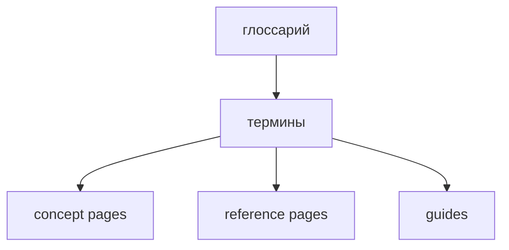

# Глоссарий

Статус: справочный документ

Эта страница даёт короткие определения терминов FEOD. Подробные правила см. на связанных reference- и structure-страницах.

## Термины

| Термин | Краткое определение | Подробнее |
| --- | --- | --- |
| FEOD | Архитектурный подход к структуре frontend-приложения через уровни, FEOD-сущности, явные зависимости и public API. | [Уровни](../core-concepts/levels.md) |
| Уровень | Верхняя структурная зона FEOD с собственной ролью и правилами зависимостей. Канонические уровни: `app`, `pages`, `modules`, `common`, `global`. | [Уровни](../core-concepts/levels.md), [Матрица импортов](./import-matrix.md) |
| Слой | Пояснительный термин для аудитории, знакомой с FSD. В FEOD основной термин - `уровень`. | [Термины](./terms.md) |
| Модуль | Самостоятельная продуктовая ответственность на уровне `modules`, которая скрывает внутреннюю структуру и открывает наружу явный public API. | [Modules](../structure/modules.md), [Public API](./public-api.md) |
| Подмодуль | Внутренняя структурная часть родительского модуля. Подмодуль не становится внешним контрактом, пока родительский модуль явно не экспортировал его через свой public API. | [Modules](../structure/modules.md), [Public API](./public-api.md) |
| Public API | Явный публичный контракт FEOD-сущности, через который её разрешено использовать извне. Для модуля точкой public API обычно является корневой `index.ts`. | [Public API](./public-api.md) |
| Публичный API | Русская форма термина `public API`. Значение то же: явный публичный контракт FEOD-сущности. | [Public API](./public-api.md), [Термины](./terms.md) |
| FEOD-сущность | Файл или директория с понятной ролью в структуре проекта. FEOD-сущность является структурной единицей, а не DDD entity. | [Термины](./terms.md) |
| DDD entity | Доменная сущность из Domain-Driven Design. В FEOD не является синонимом FEOD-сущности. | [Термины](./terms.md) |
| Контракт модуля | Набор явных обещаний модуля: ответственность, public API, потребители и скрытые внутренние детали. | [Контракт модуля](./module-contract.md) |
| `app` | Уровень композиции и запуска приложения: entrypoint, bootstrap, корневые провайдеры, верхнеуровневый роутинг и wiring. | [Уровни](../core-concepts/levels.md) |
| `pages` | Уровень пользовательских экранов, маршрутов и route-level композиции. | [Уровни](../core-concepts/levels.md) |
| `modules` | Уровень продуктовых возможностей, пользовательских сценариев и изолированных областей ответственности. | [Modules](../structure/modules.md) |
| `common` | Уровень самостоятельных переиспользуемых технических FEOD-сущностей без продуктовой привязки. | [Common](../structure/common.md) |
| `global` | Уровень редких инфраструктурных подключений глобального действия: декларации, shims, polyfills и side-effect imports. Не является обычным импортируемым контрактом. | [Global](../structure/global.md) |
| Deep import | Импорт, который обходит public API FEOD-сущности и указывает на её внутренний файл или внутреннюю директорию. | [Матрица импортов](./import-matrix.md) |
| Route-level экран | Экран, связанный с маршрутом приложения и обычно размещённый на уровне `pages`. | [Pages](../structure/pages.md) |
| Adapter-слой | Тонкий слой, который соединяет framework routing или runtime с FEOD-страницами и модулями. | [Next.js и Nuxt](../frameworks/next-nuxt.md) |
| README модуля | Документ внутри модуля, который описывает ответственность, потребителей, public API и ограничения. | [Как писать README модуля](../guides/module-readme.md) |
| MAINTAINERS | Файл ownership для крупного или критичного модуля. Не обязателен для каждого маленького модуля. | [Правила именования](./naming.md) |
| ESLint plugin | Tooling-направление для автоматической проверки импортов, public API и других FEOD-ограничений. | [ESLint plugin](../tools/eslint-plugin.md) |
| AI rules | Набор правил для AI-ассистентов, который помогает генерировать и ревьюить код в границах FEOD. | [AI rules](../tools/ai-rules.md) |
| FEOD config | Машинно-читаемая конфигурация уровней, aliases, правил и исключений проекта. | [FEOD config](../tools/feod-config.md) |
| Исключение | Явное локальное отклонение от правила с причиной, областью действия и условием пересмотра. | [Исключения из правил](../community/exceptions.md) |
| Framework appendix | Дополнительная страница про применение FEOD в конкретном frontend framework без изменения базовых правил. | [Framework appendices](../frameworks/index.md) |
| Вариация FEOD | Явно зафиксированное отклонение от канонической структуры FEOD для конкретного проекта. Вариация не является вторым каноном и должна описывать свои компромиссы. | [Вариации FEOD](../about/variations.md) |

## Смежные reference-страницы

- [Термины](./terms.md) - нормативные правила употребления терминов.
- [Матрица импортов](./import-matrix.md) - разрешённые направления импортов между уровнями.
- [Public API](./public-api.md) - правила публичного контракта модуля.
- [Контракт модуля](./module-contract.md) - минимальный контракт модуля и его границы.
