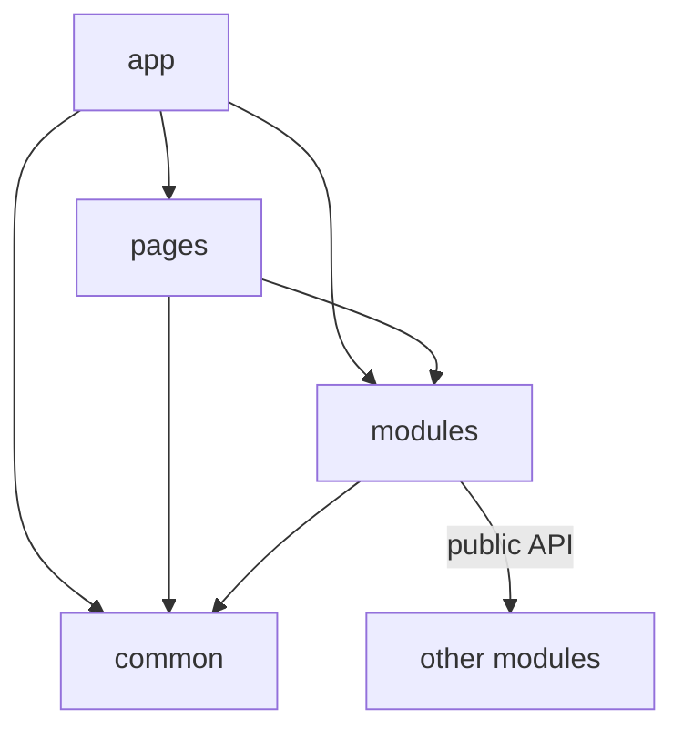

# Матрица импортов

Статус: справочный нормативный документ



Эта страница фиксирует разрешённые импорты между верхними уровнями FEOD. Правила применяются к frontend-приложению с каноническими уровнями `app`, `pages`, `modules`, `common`, `global`.

## Базовое правило

Если файл `A` импортирует файл `B`, то `A` зависит от `B` и использует `B`.

В этой странице:

- направление импорта читается слева направо: `A -> B`;
- направление зависимости совпадает с направлением импорта: `A` зависит от `B`;
- направление использования совпадает с направлением импорта: `A` использует `B`;
- обратная формулировка звучит как "`B` используется из `A`", но не означает обратный импорт.

Нельзя смешивать эти два языка. Формулировка "`modules` используются страницами" означает, что `pages` могут импортировать `modules`, а не наоборот.

## Что может импортировать код на уровне

Таблица отвечает на вопрос: "Если файл находится на уровне X, какие верхние уровни он может импортировать?"

| Код на уровне | Может импортировать | Запрещено импортировать напрямую |
| --- | --- | --- |
| `app` | `pages`, `modules`, `common` | `global`, внутренности чужих страниц, внутренности чужих модулей, deep imports |
| `pages` | `modules`, `common` | `app`, `global`, другие страницы, внутренности чужих модулей, deep imports |
| `modules` | `common`, public API других модулей, public API собственных подмодулей | `app`, `pages`, `global`, внутренности чужих модулей, deep imports |
| `common` | public API других сущностей `common`, внешние пакеты | `app`, `pages`, `modules`, `global`, внутренности чужих сущностей `common`, deep imports |
| `global` | ничего из уровней FEOD | `app`, `pages`, `modules`, `common`, внутренности продуктового кода |

Примечания:

- строка `modules` допускает зависимости между модулями только через public API целевого модуля;
- строка `common` допускает зависимости внутри `common` только между самостоятельными сущностями `common` и только через их public API;
- строка `global` не делает `global` обычной прикладной зависимостью: код приложения не импортирует `global` напрямую, а сам `global` не зависит от продуктовых уровней FEOD.

## Кто может импортировать уровень

Таблица отвечает на обратный вопрос: "Какие уровни могут зависеть от уровня X?"

| Импортируемый уровень | Кто может импортировать | Кто не может импортировать |
| --- | --- | --- |
| `app` | никто | `pages`, `modules`, `common`, `global` |
| `pages` | `app` | `pages`, `modules`, `common`, `global` |
| `modules` | `app`, `pages`, другие `modules` | `common`, `global` |
| `common` | `app`, `pages`, `modules`, другие сущности `common` | `global` |
| `global` | никто напрямую | `app`, `pages`, `modules`, `common`, импорт `global` как обычного прикладного контракта |

Эта таблица не меняет направление зависимости. Например, если `app` импортирует `pages`, то зависимость направлена от `app` к `pages`. Нельзя из этого делать вывод, что `pages` зависят от `app`.

## Public API обязателен для чужого модуля

Чужой модуль разрешено импортировать только через его public API.

Корректно:

```ts
import { UserAvatar, getUserDisplayName } from "@/modules/user";
```

Некорректно:

```ts
import { UserAvatar } from "@/modules/user/ui/UserAvatar";
import { normalizeUser } from "@/modules/user/lib/normalizeUser";
```

Правило одинаково для `app`, `pages`, `modules` и `common`: если код обращается к чужой FEOD-сущности, он обращается к её public API, а не к внутренней файловой структуре.

## Подмодули чужого модуля

Подмодуль является внутренней структурной частью своего родительского модуля, пока родительский модуль явно не экспортировал его контракт.

Запрещено:

```ts
import { UserPermissionsPanel } from "@/modules/user/permissions";
import { mapPermission } from "@/modules/user/permissions/lib/mapPermission";
```

Разрешено только если родительский модуль намеренно включил этот контракт в свой public API:

```ts
import { UserPermissionsPanel } from "@/modules/user";
```

Подмодуль не становится публичным только потому, что у него есть собственный `index.ts`.

## Deep imports

Deep import - это импорт, который обходит public API FEOD-сущности и указывает на её внутренний файл или внутреннюю директорию.

Запрещены:

```ts
import { api } from "@/modules/order/api/client";
import { OrderCard } from "@/modules/order/ui/OrderCard";
import { formatMoney } from "@/common/format/lib/formatMoney";
```

Разрешены:

```ts
import { getOrder, OrderCard } from "@/modules/order";
import { formatMoney } from "@/common/format";
```

Для линтера практическое правило такое: внешний импорт FEOD-сущности должен заканчиваться на корень её public API, а не на внутренний сегмент `ui`, `api`, `model`, `lib`, `config`, `types` или конкретный файл.

## `global` не импортируется напрямую

Уровень `global` хранит код, который действует на всё приложение: декларации окружения, shims, polyfills, runtime-инициализацию и редкие side-effect подключения. Это инфраструктурная точка подключения, а не public API для прикладного кода.

Прикладной код не импортирует `global` как зависимость:

```ts
// запрещено
import "@/global/styles.css";
import { env } from "@/global/env";
```

Подключение глобальных эффектов выполняется в одном контролируемом месте: через entrypoint, конфигурацию сборщика, HTML-шаблон, runtime bootstrap или другой инфраструктурный механизм проекта. После подключения код `app`, `pages`, `modules` и `common` не должен обращаться к `global` напрямую.

## Исключения

Исключение допустимо только если оно явно описано в архитектурном решении проекта и может быть проверено инструментом.

Допустимые классы исключений:

- entrypoint приложения подключает глобальные стили или polyfills до запуска приложения;
- тестовая инфраструктура подключает test setup, mocks или polyfills вне production-графа;
- build-time конфигурация импортирует файлы, которые не входят в runtime-граф frontend-приложения;
- временный migration alias разрешён на ограниченный срок и указывает на целевой public API, а не на внутренности.

Исключение не должно превращать внутренний файл модуля в неявный public API.

## Смежные правила

- Public API модуля описан на странице [Public API](./public-api.md).
- Контракт уровня не заменяет контракт модуля: [Матрица импортов](./import-matrix.md) говорит, какие уровни могут зависеть друг от друга, а [Public API](./public-api.md) говорит, какие символы разрешено использовать.
- Внешние пакеты не считаются уровнями FEOD, но импорт внешнего пакета не должен обходить локальный архитектурный контракт. Если пакет обёрнут в `common` или модуль, остальной код использует эту обёртку.
- Относительные импорты допустимы внутри собственной FEOD-сущности, но не должны использоваться для доступа к соседней или родительской чужой сущности.
- Type-only import не является исключением: типы чужого модуля также импортируются через его public API.
- Термины `уровень`, `public API`, `global` и `deep import` зафиксированы на странице [Термины](./terms.md).
- Типовые нарушения этих правил собраны на странице [Code smells](./code-smells.md).
