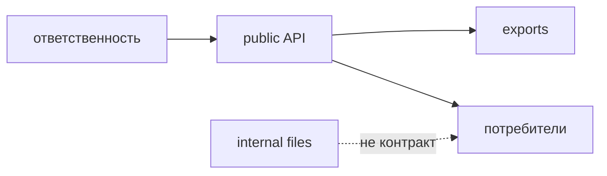

# Контракт модуля

Контракт модуля фиксирует, какую ответственность модуль берёт на себя, кто его потребляет, что он экспортирует и какие внутренние детали скрывает.



## Строгое правило

У модуля должна быть одна понятная продуктовая ответственность и явный public API. Всё, что не экспортировано из корневого `index.ts`, считается внутренней реализацией модуля.

## Минимальный контракт

| Часть контракта | Где фиксируется | Зачем нужна |
| --- | --- | --- |
| Название модуля | имя директории в `modules` | Показывает продуктовую область |
| Ответственность | README или короткое описание в review | Ограничивает рост модуля |
| Public API | корневой `index.ts` | Даёт поддерживаемую поверхность импорта |
| Внутренние детали | директории `ui`, `model`, `api`, `lib` и другие | Могут меняться без внешнего контракта |
| Ограничения зависимостей | README, review checklist или FEOD config | Помогают не создать скрытые связи |

## Good example

```text
src/modules/checkout/
  ui/
    checkout-form.tsx
  model/
    use-checkout.ts
  api/
    submit-order.ts
  README.md
  index.ts
```

```ts
// src/modules/checkout/index.ts
export { CheckoutForm } from './ui/checkout-form';
export { useCheckout } from './model/use-checkout';
```

Контракт показывает, что внешним потребителям доступны форма оформления и hook сценария. API-запрос остаётся внутренней деталью.

## Bad example

```ts
// src/modules/checkout/index.ts
export * from './ui/checkout-form';
export * from './api/submit-order';
export * from './model/internal-state';
export * from './lib/debug';
```

Нарушение: `index.ts` смешивает поддерживаемый контракт, внутреннюю модель, API-детали и debug-код.

## Исключения

Маленький модуль может не иметь README, если его ответственность очевидна из имени, структуры и public API. Исключение не отменяет требования к явному `index.ts`.

## Смежные правила

- [Public API](./public-api.md)
- [Правила именования](./naming.md)
- [Как проектировать модуль](../guides/design-module.md)
- [Как писать README модуля](../guides/module-readme.md)
