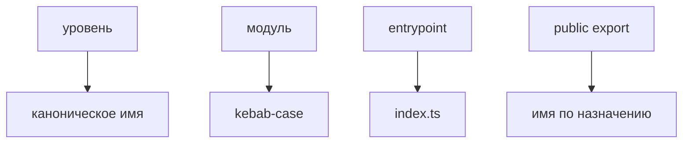

# Правила именования

Статус: справочный нормативный документ



Эта страница фиксирует имена уровней, модулей, подмодулей, `index.ts`, README/MAINTAINERS и публичных exports. Правила нужны, чтобы структура FEOD была пригодна для review, lint rules и AI rules.

## Имена верхних уровней

В FEOD используются только канонические имена верхних уровней:

```text
app
pages
modules
common
global
```

Правила:

- пишите имена уровней только в таком виде;
- используйте термин `уровень`, а не `слой`, как основной термин в reference-документах;
- используйте `global`, а не `globals`;
- не вводите дополнительные верхние уровни без отдельного архитектурного решения.

## Имена модулей

Имя модуля должно обозначать одну самостоятельную ответственность:

```text
modules/
  checkout/
  user/
  notifications/
  feature-flags/
```

Правила:

- имя модуля отражает предметную область или продуктовый сценарий;
- имя не описывает техническую папку вроде `components`, `hooks`, `services`, `utils`;
- имя не маскирует общий контейнер вроде `shared-tools`, `misc`, `helpers`;
- сквозной модуль сохраняет предметную роль: `viewer`, `auth`, `notifications`, `feature-flags`;
- если ответственность нельзя назвать коротко и предметно, граница модуля ещё не ясна.

Некорректно:

```text
modules/
  components/
  hooks/
  utils/
  shared-tools/
```

## Имена подмодулей

Подмодуль называется по устойчивой подзадаче внутри родительского модуля:

```text
modules/
  checkout/
    delivery/
    payment/
  user/
    permissions/
    settings/
```

Правила:

- имя подмодуля описывает часть ответственности родителя;
- подмодуль не получает имя самостоятельной продуктовой области, если должен стать отдельным модулем;
- подмодуль не называется по техническому типу папки, если внутри уже есть `ui`, `model`, `api` или `lib`;
- глубина вложенности больше двух-трёх уровней требует явного обоснования.

Наличие `index.ts` внутри подмодуля не делает имя подмодуля внешним импортным контрактом.

## `index.ts`

`index.ts` в корне FEOD-сущности обозначает её public API.

Правила:

- корневой `index.ts` модуля или сущности `common` содержит только явные публичные exports;
- внешний код импортирует чужую FEOD-сущность из её корня;
- `index.ts` не должен использовать `export *` из внутренних директорий;
- внутренний `index.ts` подмодуля используется для локальной организации, но не становится внешним public API автоматически;
- отсутствие символа в `index.ts` означает, что внешний код не должен импортировать этот символ.

Корректно:

```ts
export { UserAvatar } from "./ui/UserAvatar";
export { useCurrentUser } from "./model/useCurrentUser";
export type { User, UserId } from "./model/types";
```

Некорректно:

```ts
export * from "./ui";
export * from "./model";
export * from "./lib";
```

## README и MAINTAINERS

`README.md` и `MAINTAINERS` пишутся в верхнем регистре так, как принято для этих файлов:

```text
modules/
  notifications/
    README.md
    MAINTAINERS
    index.ts
```

Правила:

- `README.md` нужен, когда границы модуля, public API, подмодули или ограничения неочевидны;
- `MAINTAINERS` нужен для крупных, критичных или ownership-sensitive модулей;
- маленький очевидный модуль не обязан иметь README и MAINTAINERS;
- README родительского модуля описывает значимые подмодули, если они влияют на public API или часто вызывают ошибки в review.

## Имена публичных exports

Публичный export должен быть понятен без знания внутренней структуры файла.

Правила:

- компоненты называются существительными или noun phrase в `PascalCase`: `UserAvatar`, `CheckoutFlow`;
- hooks и composables называются с префиксом `use`: `useCurrentUser`, `useCheckoutDraft`;
- функции называются глаголом или глагольной фразой: `getUserDisplayName`, `formatDate`, `createHttpClient`;
- типы публичных props называются от компонента: `UserAvatarProps`;
- domain-типы экспортируются из владельца: `User`, `UserId`, `Order`;
- внутренние имена вроде `InternalState`, `RawDto`, `StoreShape`, `MapperConfig` не становятся публичными только ради удобства импорта;
- публичное имя не должно повторять внутреннюю папку: не используйте `UserModel`, `UserLib`, `CheckoutApi` как замену понятному контракту.

Пример:

```ts
// modules/user/index.ts
export { UserAvatar } from "./ui/UserAvatar";
export { getUserDisplayName } from "./lib/getUserDisplayName";
export { useCurrentUser } from "./model/useCurrentUser";

export type { User, UserId } from "./model/types";
export type { UserAvatarProps } from "./ui/UserAvatar";
```

## Имена сущностей `common`

Сущность `common` называется по нейтральному техническому контракту:

```text
common/
  button/
  format-date/
  http-client/
  use-debounce/
```

Правила:

- имя должно быть понятно без терминов продукта;
- не используйте общий `utils`, `helpers`, `shared`, `types`;
- не кладите доменное имя в `common`, если оно относится к модулю;
- каждая самостоятельная сущность `common` имеет собственный `index.ts`.

Некорректно:

```text
common/
  user/
  order-types/
  utils/
  shared/
```

## Имена на уровне `pages`

Страница называется по маршруту или экрану, который она собирает:

```text
pages/
  checkout/
  profile/
  catalog/
```

Правила:

- имя страницы не должно становиться именем reusable-контракта для других уровней;
- route-bound helpers могут жить внутри страницы, но не импортируются другими страницами или модулями;
- если имя файла или export начинает звучать как общий сценарий, перенесите его в `modules`.

## Имена на уровне `global`

`global` хранит только инфраструктурные сущности глобального действия:

```text
global/
  vite-env.d.ts
  shims/
  polyfills/
  types/
  styles/
```

Правила:

- не называйте импортируемые helpers, UI или stores как часть `global`;
- не используйте `global` как синоним `common`;
- файлы глобального действия должны подключаться через инфраструктурную точку входа, test setup или build-time конфигурацию.

## Связанные правила

- [Термины](./terms.md)
- [Глоссарий](./glossary.md)
- [Матрица импортов](./import-matrix.md)
- [Public API](./public-api.md)
- [Code smells](./code-smells.md)
- [Modules](../structure/modules.md)
- [Pages](../structure/pages.md)
- [Common](../structure/common.md)
- [Global](../structure/global.md)
