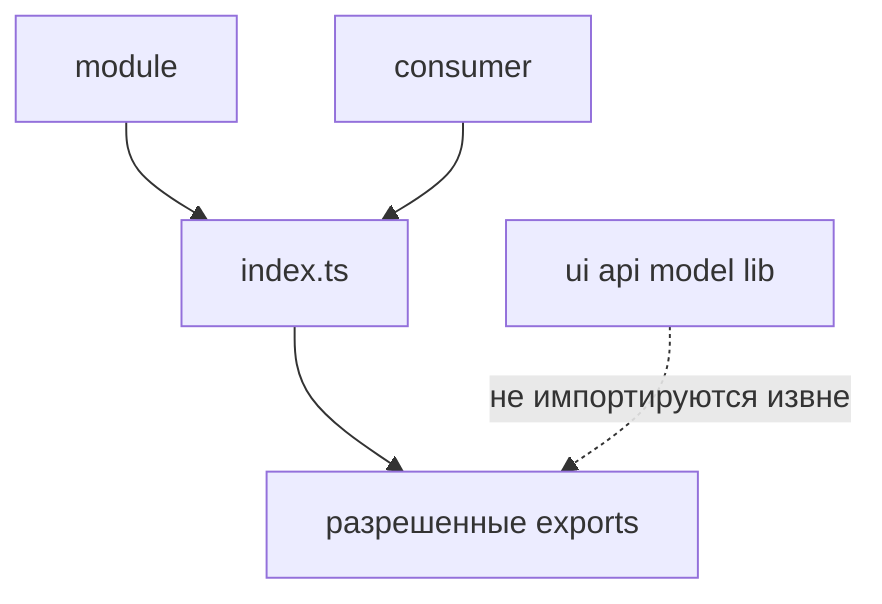

# Public API

Статус: справочный нормативный документ



`public API` модуля - это явный публичный контракт, через который модуль разрешено использовать извне.

В FEOD модуль не равен набору файлов. Модуль предоставляет наружу ограниченный контракт, а свою внутреннюю структуру сохраняет закрытой для потребителей.

## Контракт модуля

Public API отвечает на вопрос: "Что другой код имеет право импортировать из этого модуля?"

Контракт модуля включает только те сущности, которые команда готова поддерживать как внешнюю поверхность модуля:

- UI-компоненты, которые используются вне модуля;
- функции и сервисы, которые нужны другим модулям, страницам или `app`;
- типы входных и выходных данных публичных функций;
- константы и enum-like значения, если они являются частью внешнего поведения;
- публичные подмодульные контракты, если родительский модуль намеренно их открыл.

Внутренние файлы модуля не являются public API, даже если они экспортируют символы на уровне TypeScript.

## Роль `index.ts`

Файл `index.ts` в корне модуля является точкой public API модуля.

Нормативное правило:

```text
Внешний код импортирует модуль из корня модуля.
```

Корректно:

```ts
import { UserAvatar, getUserDisplayName } from "@/modules/user";
```

Некорректно:

```ts
import { UserAvatar } from "@/modules/user/ui/UserAvatar";
import { getUserDisplayName } from "@/modules/user/lib/getUserDisplayName";
```

`index.ts` не обязан экспортировать всё, что есть внутри модуля. Его задача обратная: оставить публичным только поддерживаемый контракт и скрыть детали реализации.

## Что экспортировать

Из `index.ts` экспортируются только стабильные элементы внешнего контракта.

Допустимо экспортировать:

- компоненты и функции, которые реально нужны потребителям модуля;
- типы публичных props, параметров, результатов и событий;
- публичные фабрики, адаптеры и hooks, если они являются официальным способом работы с модулем;
- именованные контракты подмодулей, если родительский модуль осознанно делает их частью API;
- минимальные domain-specific constants, если без них потребитель не может корректно использовать модуль.

Пример:

```ts
// modules/user/index.ts
export { UserAvatar } from "./ui/UserAvatar";
export { UserMenu } from "./ui/UserMenu";
export { getUserDisplayName } from "./lib/getUserDisplayName";
export { useCurrentUser } from "./model/useCurrentUser";

export type { User, UserId } from "./model/types";
export type { UserAvatarProps } from "./ui/UserAvatar";
```

Такой `index.ts` показывает намерение: потребитель видит небольшой список поддерживаемых возможностей и не знает, как модуль устроен внутри.

## Что не экспортировать

Из public API не экспортируются внутренние детали реализации.

Не экспортировать:

- приватные helpers из `lib`, которые нужны только самому модулю;
- внутренние selectors, stores, reducers, signals или atoms, если они не являются публичным контрактом;
- raw API clients, DTO и transport-детали, если потребителю нужен готовый сценарий или адаптированный тип;
- внутренние layout-компоненты и parts-компоненты, которые не должны использоваться отдельно;
- mocks, fixtures, test builders и story-only сущности;
- config-файлы, tokens и constants, которые отражают внутреннее устройство модуля;
- типы, описывающие приватное состояние, cache shape или структуру ответа конкретного backend endpoint.

Если потребителю нужен внутренний helper, это не повод экспортировать helper автоматически. Сначала нужно определить, является ли этот helper частью внешнего сценария модуля. Если да, public API должен открыть сценарий в устойчивой форме; если нет, потребитель должен решить задачу через уже существующий контракт.

## Антипример: `export *`

`export *` из внутренних директорий запрещён для public API модуля.

Некорректно:

```ts
// modules/user/index.ts
export * from "./api";
export * from "./model";
export * from "./ui";
export * from "./lib";
```

Почему это ошибка:

- public API начинает зависеть от случайной файловой структуры;
- наружу попадают внутренние helpers и типы;
- любое переименование внутри модуля становится breaking change для потребителей;
- невозможно понять, какие символы поддерживаются как контракт;
- линтер и AI rules не могут отличить намеренный экспорт от утечки реализации.

Если нужно открыть несколько символов из одной директории, они перечисляются явно:

```ts
export { UserAvatar } from "./ui/UserAvatar";
export type { UserAvatarProps } from "./ui/UserAvatar";
```

## Как менять внутренности без поломки потребителей

Модуль можно свободно реорганизовывать внутри, пока сохраняется его public API.

Разрешено без изменения потребителей:

- переносить файл из `lib` в `model`, если экспорт из `index.ts` остался прежним;
- переименовывать внутренний helper, если публичное имя не изменилось;
- менять реализацию компонента, если его публичные props и поведение сохранены;
- заменить transport client, если публичная функция возвращает тот же контракт;
- разделить большой файл на несколько внутренних файлов, не меняя корневые exports.

Breaking change возникает, когда меняется публичный контракт:

- удалён экспорт из `index.ts`;
- изменено имя публичного экспорта;
- изменён тип публичных props, параметров или результата;
- изменена семантика публичной функции при прежней сигнатуре;
- публичный подмодуль перестал экспортироваться через родительский модуль.

Перед изменением public API нужно обновить потребителей, миграционные инструкции или совместимый alias. Временный alias должен оставаться в `index.ts` и вести к public API, а не к внутреннему файлу.

## Подмодули и public API

Подмодуль может иметь собственный `index.ts` для внутренней организации, но этот файл не становится внешним контрактом автоматически.

Внешний потребитель импортирует подмодульный контракт через родительский модуль:

```ts
import { UserPermissionsPanel } from "@/modules/user";
```

Не через внутренний путь:

```ts
import { UserPermissionsPanel } from "@/modules/user/permissions";
```

Если команда хочет сделать подмодуль самостоятельной FEOD-сущностью, его нужно вынести на уровень самостоятельного модуля или явно описать как отдельный публичный контракт проекта. Пока этого нет, подмодуль является внутренней структурой родительского модуля.

## Type-only exports

Типы являются частью public API так же, как runtime-exports.

Корректно:

```ts
export type { User, UserId } from "./model/types";
```

Некорректно:

```ts
export type * from "./model/internal-state";
```

Потребитель не должен импортировать приватные типы через deep import только потому, что они исчезают после компиляции. Архитектурная зависимость существует и для type-only imports.

## Смежные правила

- Правила того, кто может импортировать модуль, описаны на странице [Матрица импортов](./import-matrix.md).
- Public API отвечает за контракт символов, а матрица импортов отвечает за допустимое направление зависимостей.
- Public API не должен отражать структуру папок `ui`, `api`, `model`, `lib`; эти папки являются деталями реализации модуля.
- Внешний пакет может быть скрыт за public API модуля или `common`, если проект хочет контролировать зависимость от этого пакета.
- Любой экспорт из `index.ts` должен восприниматься как поддерживаемый контракт, пока он явно не помечен как deprecated и не удалён по правилам миграции проекта.
- Нормативные формулировки для `public API` и `публичный API` зафиксированы на странице [Термины](./terms.md).
- Ошибки вроде `export *` и deep imports описаны на странице [Code smells](./code-smells.md).
