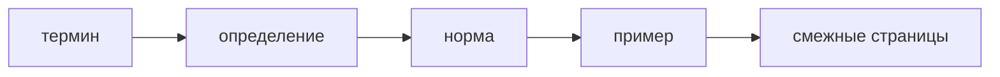

# Термины

Статус: справочный нормативный документ



Эта страница фиксирует, какие термины использовать в документации FEOD. Если страница расходится с этими правилами, корректируется страница.

## Канонические имена уровней

В пользовательской документации FEOD используются только эти имена верхних уровней:

```text
app
pages
modules
common
global
```

Правила:

- писать имена уровней только в таком виде;
- писать `global`, а не `globals`;
- не переводить имена уровней на русский язык;
- не вводить дополнительные верхние уровни без отдельного архитектурного решения.

## Уровень и слой

Основной русский термин для `app`, `pages`, `modules`, `common`, `global` - `уровень`.

| Писать | Не писать |
| --- | --- |
| `уровень modules` | `слой modules` как основной термин |
| `верхний уровень pages` | `слой pages` в заголовке или определении |
| `уровни FEOD` | свободно чередовать `уровень` и `слой` |

`Слой` допустим только как пояснение для читателя, знакомого с FSD:

```text
В FEOD это называется уровнем; для аудитории FSD это ближайший аналог слоя.
```

После такого пояснения страница должна использовать термин `уровень`.

## Public API

Допустимые формы:

- `public API`;
- `публичный API`.

Обе формы означают одно и то же: явный публичный контракт, через который FEOD-сущность разрешено использовать извне.

Правила:

- в пределах одной страницы выбрать одну основную форму и использовать её последовательно;
- использовать `public API`, если рядом есть `index.ts`, примеры импортов или кодовые идентификаторы;
- использовать `публичный API`, если страница полностью объяснительная и русскоязычная;
- не писать `публичное API`, `паблик API`, `public контракт` или другие разговорные варианты.

Нормативная формулировка:

```text
public API модуля - это его явный публичный контракт, через который модуль разрешено использовать извне.
```

## FEOD-сущность и DDD entity

`FEOD-сущность` и `DDD entity` не являются синонимами.

| Термин | Значение |
| --- | --- |
| FEOD-сущность | Файл или директория с понятной ролью в структуре проекта. |
| DDD entity | Доменная сущность из Domain-Driven Design. |

Правила:

- FEOD-сущность описывать как структурную единицу с ролью и ограничениями;
- не объяснять FEOD-сущность как вариант DDD entity;
- если на странице упоминается DDD, явно развести эти понятия;
- не использовать английское `entity` без уточнения, если речь идёт о FEOD-сущности.

Допустимая краткая формулировка:

```text
Сущность FEOD - это структурная единица с ролью, а не domain entity из DDD.
```

## Модуль и подмодуль

`Модуль` - самостоятельная продуктовая ответственность на уровне `modules`.

`Подмодуль` - внутренняя структурная часть родительского модуля. Подмодуль не становится внешним контрактом только потому, что у него есть собственный `index.ts`.

| Писать | Не писать |
| --- | --- |
| `модуль открывает public API через корневой index.ts` | `модуль равен набору файлов` |
| `подмодуль остаётся частью родительского модуля` | `подмодуль можно импортировать напрямую извне` |
| `родительский модуль экспортирует подмодульный контракт` | `index.ts подмодуля автоматически публичный` |

Если подмодуль должен стать самостоятельной FEOD-сущностью, это нужно описать как отдельное архитектурное решение, а не как следствие вложенной папки.

## Deep import

`Deep import` - импорт, который обходит public API FEOD-сущности и указывает на её внутренний файл или внутреннюю директорию.

Писать:

```text
deep import во внутренности модуля запрещён.
```

Не писать:

```text
глубокий импорт допустим, если путь работает в TypeScript.
```

Рабочий TypeScript-import не делает путь допустимым по правилам FEOD.

## Нормативные формулировки

| Смысл | Использовать | Не использовать |
| --- | --- | --- |
| Верхняя структурная зона | `уровень` | `слой` как основной термин |
| Канонический глобальный уровень | `global` | `globals` |
| Публичный контракт модуля | `public API` или `публичный API` | `паблик API`, `публичное API` |
| Структурная единица FEOD | `FEOD-сущность`, `сущность FEOD` | `DDD entity`, если речь не о DDD |
| Вложенная часть модуля | `подмодуль` | `самостоятельный модуль`, если родитель не открыл контракт |
| Обход публичного контракта | `deep import` | `прямой импорт`, если смысл неоднозначен |

## Перед публикацией страницы

Автор проверяет:

1. Верхние уровни названы как `app`, `pages`, `modules`, `common`, `global`.
2. Основной термин для верхних структурных зон - `уровень`.
3. `Слой` используется только как пояснение для аудитории FSD.
4. На странице последовательно выбрана форма `public API` или `публичный API`.
5. FEOD-сущность явно отделена от DDD entity.
6. `global` нигде не заменён на `globals`.
7. Подмодуль не описан как внешний контракт без экспорта из родительского модуля.
8. Deep import не представлен как допустимый путь к внутренностям FEOD-сущности.

## Связанные страницы

- [Глоссарий](./glossary.md)
- [Матрица импортов](./import-matrix.md)
- [Public API](./public-api.md)
- [Уровни](../core-concepts/levels.md)
