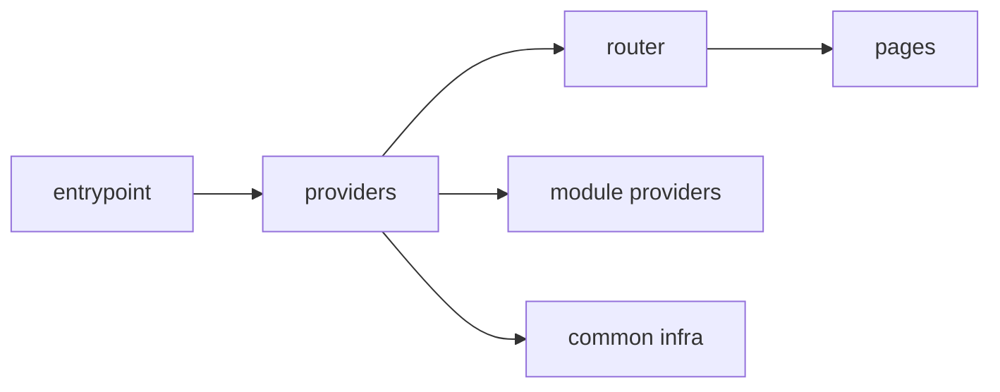

# App



## Короткое определение

`app` - это верхний уровень композиции и запуска приложения. Он собирает entrypoint, router, providers, layout shell, глобальные подключения и wiring между крупными частями системы.

## Какую проблему решает

Без отдельного уровня `app` запуск приложения и продуктовая логика смешиваются в случайных файлах. Тогда router, providers, глобальные side effects и доменные сценарии начинают жить вперемешку, а граница между инфраструктурой и приложением становится неясной.

## Базовое правило

На уровне `app` хранится только то, что нужно для сборки приложения в целое:

- entrypoints и bootstrap;
- router верхнего уровня;
- providers приложения;
- глобальные стили и entrypoint side effects;
- layout shell;
- app-level integrations;
- dependency wiring между `pages`, `modules` и `common`.

`app` может импортировать только `pages`, `modules` и `common`. Код из `modules` и `pages` не импортирует `app`.

## Почему

`app` должен оставаться контролируемой точкой входа. Если сюда попадает доменная логика, этот уровень становится вторым `modules` и перестаёт объяснять, где заканчивается инфраструктура приложения и начинается продуктовый код.

Такая граница упрощает навигацию. По файлу из `app` сразу видно, что он отвечает за composition, а не за отдельный пользовательский сценарий.

## Что обычно лежит в `app`

- `main.tsx`, `bootstrap.ts`, `index.tsx`;
- `App.tsx`, `AppShell.tsx`;
- `router/` с route-конфигурацией верхнего уровня;
- `providers/` с корневыми провайдерами;
- подключение глобальных стилей, polyfills и runtime setup;
- композиция cross-cutting интеграций уровня приложения.

## Что не должно лежать в `app`

- доменная бизнес-логика;
- логика конкретной страницы;
- внутренности чужих модулей через deep import;
- reusable logic без app-назначения;
- `shared`- или `common`-помойка "на всякий случай";
- код, который требует импорта `app` из `modules` или `pages`.

## Good example

```text
app/
  main.tsx
  App.tsx
  router/
    index.tsx
  providers/
    QueryProvider.tsx
    AuthProvider.tsx
  layouts/
    AppShell.tsx
```

```ts
// app/App.tsx
import { AppRouter } from "@/pages";
import { AppShell } from "./layouts/AppShell";
import { AuthProvider } from "./providers/AuthProvider";
import { QueryProvider } from "./providers/QueryProvider";

export function App() {
  return (
    <QueryProvider>
      <AuthProvider>
        <AppShell>
          <AppRouter />
        </AppShell>
      </AuthProvider>
    </QueryProvider>
  );
}
```

Что здесь правильно:

- `app` собирает приложение, а не реализует предметный сценарий;
- router приходит через public API уровня `pages`;
- провайдеры и shell остаются частью композиции приложения;
- нет deep import во внутренности модулей.

## Bad example

```ts
// app/session.ts
import { normalizeUser } from "@/modules/user/lib/normalizeUser";
import { CheckoutPage } from "@/pages/checkout";

export async function refreshSession() {
  const page = CheckoutPage;
  return normalizeUser(page);
}
```

Нарушение:

- `app` импортирует внутренний файл чужого модуля;
- `app` зависит от внутреннего пути страницы вместо её route-level контракта;
- композиционный уровень начал писать доменную логику.

## Частые ошибки

- Класть в `app` сценарии уровня `checkout`, `profile`, `catalog` -> такие сценарии должны жить в `modules`.
- Делать из `app` место для случайных helpers -> появляется новая `common`-помойка без явной роли.
- Импортировать `global` как прикладной контракт -> глобальные подключения должны входить через entrypoint или другой инфраструктурный механизм.
- Экспортировать внутренние части `app` наружу и использовать их в `modules` или `pages` -> направление зависимостей нарушается.
- Хранить page-level loading и error state в `app`, когда они относятся к одному маршруту -> это зона `pages`.

## Исключения

Допустимы только инфраструктурные исключения:

- entrypoint подключает глобальные стили, polyfills или shims;
- тестовый bootstrap поднимает провайдеры и setup вне production-графа;
- build-time конфигурация использует файлы, не входящие в runtime-граф приложения.

Эти исключения не делают `app` источником доменной логики и не разрешают импорт `app` из нижележащих уровней.

## Углублённые паттерны

Следующие паттерны допустимы, но не являются базовым описанием уровня `app`:

- несколько entrypoints для разных сборок или платформ;
- composition root для dependency injection;
- разделение shell на authenticated и public варианты;
- app-level observability, feature flags и experiment wiring;
- SSR bootstrap, hydration и адаптеры окружения.

Их добавляют только после того, как базовая роль `app` уже ясна и не спорит с матрицей импортов.

## Связанные страницы

- [Уровни](../core-concepts/levels.md)
- [Правила зависимостей](../core-concepts/dependency-rules.md)
- [Матрица импортов](../reference/import-matrix.md)
- [Code smells](../reference/code-smells.md)
