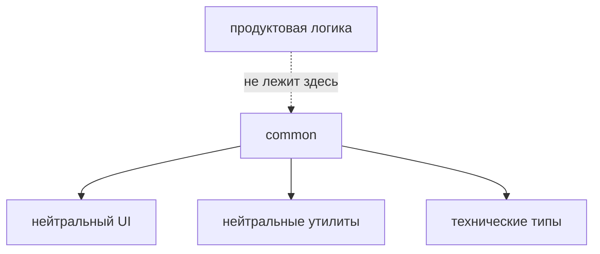

# Common



## Короткое определение

`common` - это уровень для самостоятельных переиспользуемых FEOD-сущностей без продуктовой привязки. Здесь хранятся только общие технические контракты, которые могут использовать `app`, `pages`, `modules` и другие сущности `common`.

## Какую проблему решает

Без отдельного уровня для нейтральных технических сущностей одинаковые UI-примитивы, утилиты и framework helpers начинают дублироваться по модулям. Обратная крайность тоже опасна: если складывать в `common` всё непонятное, он превращается в скрытый shared-каталог без границ.

## Правило

В `common` разрешено хранить только небизнесовые переиспользуемые сущности:

- UI primitives;
- utilities;
- общие типы;
- framework helpers;
- небизнесовые hooks и composables;
- shared constants.

`common` не должен хранить бизнес-логику, доменные сущности, API конкретного модуля, сценарное состояние и любой код, который по смыслу должен принадлежать модулю.

## Почему

`common` нужен как узкий технический уровень, а не как запасной контейнер. Чем строже его граница, тем проще понять, является ли сущность действительно общей или её нужно оставить внутри модуля. Это удерживает прикладную логику рядом с предметной областью и не даёт общему коду становиться неявным центром зависимостей.

## Что обычно лежит в `common`

В `common` обычно находятся:

- кнопки, инпуты, модальные примитивы, layout primitives;
- форматтеры дат, чисел, строк и технические validators без доменного смысла;
- обёртки над framework API, которые не знают о конкретном продукте;
- общие типы UI или инфраструктуры;
- hooks и composables вроде `useDebounce`, `useMediaQuery`, `usePrevious`;
- константы уровня платформы или UI, не привязанные к одному модулю.

## Что не должно лежать в `common`

В `common` не должно быть:

- правил предметной области;
- сущностей вроде `User`, `Order`, `Invoice`, если они относятся к конкретному продукту;
- API-клиента каталога, чекаута, профиля или другого модуля;
- stores, reducers, query state и другого сценарного состояния;
- кода, который появился только потому, что автор не понял, в какой модуль его положить.

Если сущность нужна одному модулю или описывает один продуктовый сценарий, её место в `modules`, а не в `common`.

## Good example

```text
common/
  button/
    index.ts
    ui/Button.tsx
  use-debounce/
    index.ts
    lib/useDebounce.ts
  format-date/
    index.ts
    lib/formatDate.ts
  breakpoints/
    index.ts
    config/breakpoints.ts
```

```ts
import { Button } from "@/common/button";
import { useDebounce } from "@/common/use-debounce";
import { formatDate } from "@/common/format-date";
```

Почему это корректно:

- все сущности переиспользуемы вне одного модуля;
- они не описывают продуктовый сценарий;
- внешний код импортирует их через public API.

## Bad example

```text
common/
  user/
    model/userStore.ts
  checkout-api/
    api/createOrder.ts
  cart-summary/
    ui/CartSummary.tsx
```

Нарушение: в `common` оказались доменная модель, API конкретного модуля и UI продуктового сценария.

## Частые ошибки

- Выносить код в `common`, потому что он "может пригодиться потом" -> уровень начинает расти без явной ответственности.
- Переносить в `common` типы доменной сущности, чтобы их было удобнее импортировать -> доменная модель отделяется от модуля, которому принадлежит.
- Держать в `common` API-клиент одного модуля -> техническая деталь модуля становится ложным общим контрактом.
- Складывать сюда stores, reducers и query state -> сценарное состояние теряет границы и начинает протекать между модулями.
- Публиковать из `common` слишком крупные helpers, которые фактически собирают бизнес-правило -> общий уровень начинает содержать прикладную логику.

## Исключения

Исключений для бизнес-логики нет. Если код выглядит общим, но при этом знает о предметной области, сначала проверьте, не нужен ли отдельный модуль или подмодуль.

## Связанные страницы

- [Уровни](../core-concepts/levels.md)
- [Правила зависимостей](../core-concepts/dependency-rules.md)
- [Матрица импортов](../reference/import-matrix.md)
- [Как не превратить common в свалку](../guides/common-boundaries.md)
- [Code smells](../reference/code-smells.md)
