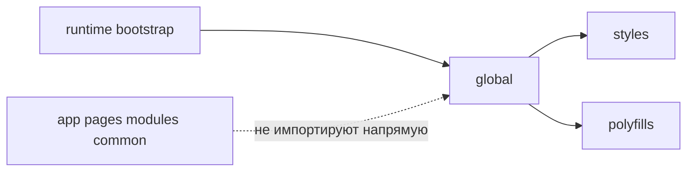

# Global



## Короткое определение

`global` - это уровень для редких инфраструктурных подключений, которые действуют на всё приложение. Он не является обычным прикладным уровнем и не должен использоваться как место для импортируемого общего кода.

## Какую проблему решает

Некоторые вещи должны подключаться один раз и иметь глобальный эффект: `.d.ts`, shims, polyfills, глобальные расширения типов, side-effect imports. Если такой код смешать с `app`, `common` или модулями, он становится неявной зависимостью и начинает выглядеть как обычный переиспользуемый контракт.

## Правило

В `global` разрешено хранить только инфраструктурные сущности глобального действия:

- `.d.ts`;
- shims;
- polyfills;
- глобальные расширения типов;
- side-effect imports.

`global` - редкий и опасный уровень. Он не должен содержать бизнес-логику, UI, helpers, скрытый общий каталог и любые импортируемые сущности.

## Почему

`global` трудно локализовать и трудно проверять глазами в review. Код на этом уровне влияет не на один сценарий, а на всё приложение сразу. Поэтому `global` должен быть маленьким, явным и подключаться только через инфраструктурную точку входа, а не через обычные импорты из продуктового кода.

## Что обычно лежит в `global`

В `global` обычно находятся:

- `env.d.ts`, `vite-env.d.ts` и другие декларации окружения;
- shims для платформы или тестовой среды;
- polyfills, которые подключаются до запуска приложения;
- `declare global` и другие расширения глобальных типов;
- side-effect imports вроде глобальных стилей или runtime setup, если проект подключает их через entrypoint или конфигурацию.

## Что не должно лежать в `global`

В `global` не должно быть:

- компонентов, layout primitives и другого UI;
- helpers, utilities и composables, которые можно импортировать по месту;
- продуктовых констант, типов и моделей;
- API-клиентов, stores, сценарной логики;
- файлов, которые другие уровни импортируют как обычную зависимость.

Если сущность должна импортироваться из `app`, `pages`, `modules` или `common`, ей не место в `global`.

## Good example

```text
global/
  vite-env.d.ts
  shims/
    match-media.ts
  polyfills/
    resize-observer.ts
  types/
    window.d.ts
  styles/
    reset.css
```

```ts
// entrypoint приложения
import "@/global/styles/reset.css";
import "@/global/polyfills/resize-observer";
```

Почему это корректно:

- все файлы либо объявляют глобальный контракт, либо дают глобальный side effect;
- подключение идёт из инфраструктурной точки входа как исключение для глобальных эффектов;
- `global` не используется как каталог обычных импортируемых сущностей.

## Bad example

```text
global/
  env.ts
  ui/Spinner.tsx
  lib/formatMoney.ts
  auth/store.ts
```

```ts
import { env } from "@/global/env";
import { formatMoney } from "@/global/lib/formatMoney";
```

Нарушение: `global` превратился в скрытый общий каталог с импортируемыми helpers, UI и состоянием.

## Частые ошибки

- Класть в `global` helper только потому, что он нужен "везде" -> частота использования не делает код глобальным.
- Хранить здесь runtime-конфиг как импортируемый модуль -> появляется обычная прикладная зависимость от `global`.
- Складывать в `global` стили компонентов и UI-примитивы -> уровень начинает смешивать инфраструктуру и интерфейс.
- Использовать `global` как синоним `common` -> исчезает граница между импортируемым общим кодом и глобальными эффектами.
- Думать, что `global` и `globals` равноправны -> в документации FEOD каноническое имя только `global`.

## Исключения

Исключения допускаются только для инфраструктурного подключения. Например, entrypoint, test setup или build-time конфигурация могут подключать файлы из `global`, если это не превращает их в обычный прикладной контракт.

## Связанные страницы

- [Уровни](../core-concepts/levels.md)
- [Правила зависимостей](../core-concepts/dependency-rules.md)
- [Матрица импортов](../reference/import-matrix.md)
- [Термины](../reference/terms.md)
