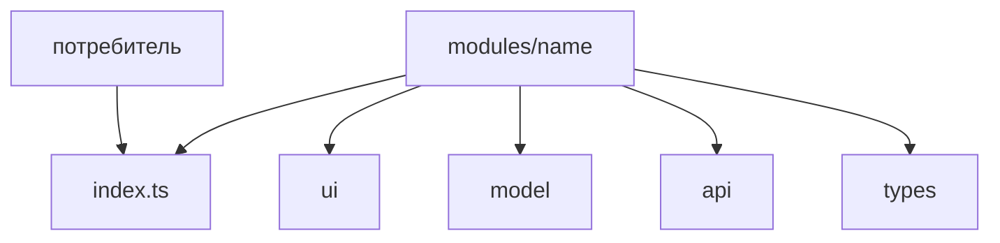

# Modules



## Короткое определение

`modules` - это основной уровень продуктовой логики FEOD. Модуль собирает одну область ответственности, хранит её внутреннюю структуру и открывает наружу только явный public API.

## Какую проблему решает

Без сильного уровня `modules` прикладная логика расползается по страницам, `app` и `common`. Тогда сценарии трудно переиспользовать, внутренности начинают импортировать напрямую, а структура перестаёт отражать реальные границы ответственности.

## Базовое правило

Модуль должен представлять одну самостоятельную ответственность. Внешний код использует модуль только через его public API, а внутренняя структура модуля остаётся приватной.

`modules` - самая глубокая Structure-страница в базовом описании FEOD. Всё, что глубже, относится к внутренней организации самого модуля, а не к отдельному верхнему уровню.

## Почему

Модуль локализует изменения. UI, model, api, tests и вспомогательная логика одной ответственности живут рядом и меняются вместе.

Явный public API удерживает внешний контракт маленьким. Это позволяет менять внутреннее устройство модуля без поломки потребителей и без нарушения reference-правил про deep import.

## Базовая структура модуля

У модуля нет обязательного набора внутренних директорий, но у него должны быть:

- корень модуля с явным `index.ts`;
- понятная зона ответственности;
- внутренняя структура, подчинённая этой ответственности;
- локальные тесты по риску изменения.

Типичная структура:

```text
modules/
  profile/
    index.ts
    ui/
      ProfileCard.tsx
    model/
      useProfile.ts
      profile.types.ts
    api/
      profile-client.ts
    lib/
      map-profile.ts
    __tests__/
      useProfile.test.ts
```

## Public API модуля

Внешний код импортирует модуль только из корня:

```ts
import { ProfileCard, useProfile } from "@/modules/profile";
```

Deep imports во внутренности модуля запрещены:

```ts
import { ProfileCard } from "@/modules/profile/ui/ProfileCard";
import { mapProfile } from "@/modules/profile/lib/map-profile";
```

Подробные правила контракта определяет [Public API](../reference/public-api.md). Structure-страница фиксирует роль этого контракта: модуль не равен набору файлов, модуль равен ответственности плюс явный внешний вход.

## Подмодули

Подмодуль нужен, когда внутри одного модуля появляется устойчивая подзадача со своей внутренней структурой. Подмодуль остаётся частью родительского модуля, пока родитель явно не открыл его наружу через собственный public API.

Корректно:

```text
modules/
  checkout/
    index.ts
    delivery/
      index.ts
      ui/
        DeliveryForm.tsx
    payment/
      index.ts
      ui/
        PaymentForm.tsx
```

```ts
// modules/checkout/index.ts
export { DeliveryForm } from "./delivery";
export { PaymentForm } from "./payment";
```

Некорректно:

```ts
import { DeliveryForm } from "@/modules/checkout/delivery";
```

Нарушение: внешний код использует подмодуль как отдельный контракт без экспорта из корня родительского модуля.

## Сквозные модули

Сквозной модуль допустим, если одна ответственность участвует в нескольких сценариях и нескольких страницах, но всё ещё остаётся одной предметной областью. Такой модуль не становится `common` только потому, что используется в нескольких местах.

Пример:

- `auth`;
- `viewer`;
- `feature-flags`;
- `notifications`.

Сквозной модуль должен сохранять предметную роль и не зависеть от `pages` или `app`.

## Однофайловые модули

Однофайловый модуль допустим, если ответственность маленькая, но уже самостоятельная. В этом случае модуль всё равно должен выглядеть как модуль, а не как случайный файл без контракта.

Корректно:

```text
modules/
  logout/
    index.ts
```

```ts
// modules/logout/index.ts
export function logout() {
  // реализация
}
```

Некорректно делать отдельный каталог ради одного файла, если у ответственности нет самостоятельного смысла. Тогда это обычно часть другого модуля или сущность `common`.

## Взаимодействие модулей

Модули могут импортировать другие модули только через их public API. Направление зависимости определяется матрицей импортов, а не тем, какой модуль "важнее".

Разрешено:

```ts
import { getViewer } from "@/modules/viewer";
```

Запрещено:

```ts
import { getViewer } from "@/modules/viewer/model/getViewer";
import { AppShell } from "@/app/AppShell";
import { CatalogPage } from "@/pages/catalog";
```

Нарушение:

- deep import во внутренности чужого модуля;
- импорт `app` из `modules`;
- импорт `pages` из `modules`.

## Testing

Тестирование модуля должно быть локальным по риску изменения:

- unit-тесты для локальной логики и преобразований;
- component-тесты для публичных UI-контрактов;
- integration-тесты для сценария модуля, если он связывает несколько внутренних частей.

Страница не должна быть единственным местом, где проверяется поведение модуля. Если ошибка относится к ответственности модуля, тест должен находиться рядом с модулем или с его публичным контрактом.

## README и MAINTAINERS

`README.md` нужен, когда без него границы модуля неочевидны или у модуля есть заметные правила использования. В README обычно фиксируют:

- назначение модуля;
- что входит в public API;
- что считается внутренней деталью;
- какие подмодули и зависимости являются ключевыми.

`MAINTAINERS` нужен для крупных или критичных модулей, у которых важно быстро понять зону ответственности команды или владельцев. Этот файл не обязателен для каждого маленького модуля, но полезен там, где ownership влияет на скорость изменений и review.

## Good example

```text
modules/
  notifications/
    README.md
    MAINTAINERS
    index.ts
    ui/
      NotificationsBell.tsx
      NotificationsPanel.tsx
    model/
      useNotifications.ts
      notifications-store.ts
      notifications.types.ts
    api/
      notifications-client.ts
    lib/
      group-notifications.ts
    __tests__/
      notifications-store.test.ts
```

```ts
// modules/notifications/index.ts
export { NotificationsBell } from "./ui/NotificationsBell";
export { NotificationsPanel } from "./ui/NotificationsPanel";
export { useNotifications } from "./model/useNotifications";

export type { NotificationItem } from "./model/notifications.types";
```

Что здесь правильно:

- одна ответственность объединяет UI, model, api и tests;
- наружу открыт только явный public API;
- ownership и назначение зафиксированы рядом с модулем;
- структура может расти внутрь без открытия внутренних файлов наружу.

## Bad example

```text
modules/
  shared-tools/
    Button.tsx
    useDebounce.ts
    auth-client.ts
    user-store.ts
    order-mapper.ts
```

Нарушение: каталог на уровне `modules` смешивает несвязанные ответственности и фактически маскирует `common`-помойку или набор случайных файлов.

```ts
import { userStore } from "@/modules/profile/model/user-store";
import { AppRouter } from "@/app/router";
```

Нарушение:

- внешний код идёт во внутренности чужого модуля;
- модуль зависит от `app`.

## Частые ошибки

- Создавать модуль по имени папки, а не по ответственности -> структура выглядит аккуратно, но не несёт архитектурного смысла.
- Открывать наружу почти всё через `export *` -> public API превращается в слепок внутренней структуры.
- Считать подмодуль внешним контрактом сам по себе -> пока родитель не экспортировал его, это внутренняя часть модуля.
- Перекладывать предметный код в `common`, потому что он нужен в двух модулях -> повторное использование не отменяет продуктовую принадлежность.
- Проверять модуль только через e2e или страницу -> локальные ошибки труднее обнаружить и изолировать.
- Не фиксировать ownership крупного модуля -> следующий автор тратит время на выяснение границ и ответственных.

## Исключения

Маленький модуль может обойтись без `README.md` и `MAINTAINERS`, если его назначение очевидно из имени, структуры и public API. Это исключение не отменяет требования к явной ответственности и контракту.

Временный migration-модуль допустим, если у него уже есть чёткие границы и план удаления или слияния. Временность не оправдывает deep imports и смешение нескольких несвязанных областей.

## Углублённые паттерны

Следующие паттерны не входят в базовое описание модуля и должны рассматриваться отдельно:

- многоступенчатые подмодули глубже двух-трёх уровней;
- plugin-like модули с регистрацией extension points;
- bounded contexts и DDD-термины поверх FEOD-структуры;
- cross-runtime модули для web, mobile и SSR с разными адаптерами;
- микрофронтендные границы и федерация модулей.

Базовые правила при этом не меняются: одна ответственность, явный public API и отсутствие запрещённых зависимостей.

## Связанные страницы

- [Модульность](../core-concepts/modularity.md)
- [Фрактальность](../core-concepts/fractality.md)
- [Матрица импортов](../reference/import-matrix.md)
- [Public API](../reference/public-api.md)
- [Правила именования](../reference/naming.md)
- [Code smells](../reference/code-smells.md)
