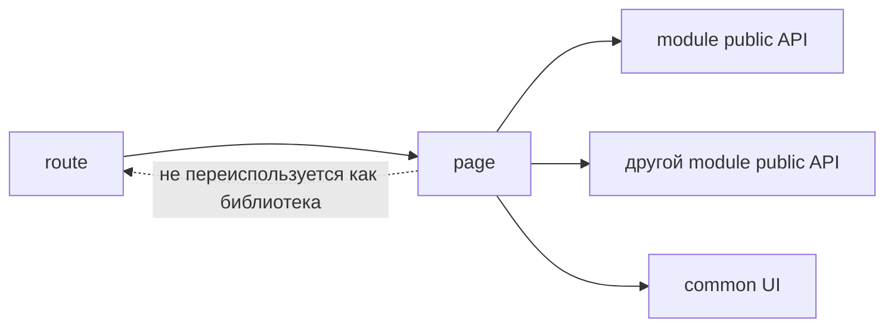

# Pages



## Короткое определение

`pages` - это уровень route-level компонентов и композиции экрана. Он связывает маршрут с нужными модулями, layout-обёртками и page-level состояниями загрузки или ошибки.

## Какую проблему решает

Без уровня `pages` маршруты начинают жить прямо в `app` или размазываются по модулям. Тогда трудно понять, где находится экран как пользовательская точка входа, а где находится переиспользуемый продуктовый сценарий.

## Базовое правило

На уровне `pages` хранится минимальная логика маршрута:

- route-level компоненты;
- композиция модулей и `common`-сущностей для одного экрана;
- page-level loading, empty и error states;
- минимальная route-логика вроде чтения route params и выбора нужной композиции.

`pages` может импортировать только `modules` и `common`. `pages` не импортирует `app`, другие страницы, `global` и внутренности чужих модулей.

## Почему

Страница должна быть точкой сборки экрана, а не основным местом для бизнес-логики. Тогда пользовательский маршрут остаётся читаемым, а повторно используемый сценарий легко вынести или переиспользовать через `modules`.

Это также удерживает dependency graph простым: `app` собирает страницы, страницы собирают модули, а модули не знают о маршрутах.

## Что обычно лежит в `pages`

- route-level компонент страницы;
- локальная композиция нескольких модулей на одном экране;
- loading, error, empty, forbidden-состояния уровня страницы;
- чтение `params`, `query`, route meta;
- page-specific layout wiring.

## Что не должно лежать в `pages`

- основная бизнес-логика продукта;
- reusable logic как источник для других страниц или модулей;
- глобальная инициализация приложения;
- прямые зависимости между страницами;
- deep import во внутренности чужих модулей.

## Good example

```text
pages/
  checkout/
    index.ts
    ui/
      CheckoutPage.tsx
    model/
      useCheckoutRoute.ts
```

```ts
// pages/checkout/ui/CheckoutPage.tsx
import { CheckoutFlow } from "@/modules/checkout";
import { PageLayout } from "@/common/page-layout";
import { useCheckoutRoute } from "../model/useCheckoutRoute";

export function CheckoutPage() {
  const { orderId, isInvalid } = useCheckoutRoute();

  if (isInvalid) {
    return <PageLayout title="Оформление">Некорректный заказ</PageLayout>;
  }

  return (
    <PageLayout title="Оформление">
      <CheckoutFlow orderId={orderId} />
    </PageLayout>
  );
}
```

Что здесь правильно:

- страница собирает экран из public API модуля;
- route-логика остаётся минимальной и относится к маршруту;
- reusable сценарий `CheckoutFlow` живёт в `modules`, а не в странице.

## Bad example

```ts
// pages/checkout/ui/CheckoutPage.tsx
import { submitOrder } from "@/pages/checkout/lib/submitOrder";
import { paymentClient } from "@/modules/checkout/api/paymentClient";
import { CatalogPage } from "@/pages/catalog";

export function CheckoutPage() {
  return submitOrder(paymentClient, CatalogPage);
}
```

Нарушение:

- страница стала источником основной бизнес-логики;
- есть deep import во внутренности модуля;
- страница зависит от другой страницы напрямую.

## Частые ошибки

- Держать большой пользовательский сценарий внутри одной страницы -> если сценарий нужен не только маршруту, его нужно оформить как модуль.
- Делать страницу источником reusable hooks и helpers -> это превращает `pages` в неявный уровень shared-логики.
- Импортировать `app` для доступа к router, providers или shell -> такие зависимости должны приходить сверху.
- Размещать в `pages` общий UI без привязки к экрану -> это уровень `common` или `modules`.
- Прятать основную route-логику в `app`, хотя она относится к одному маршруту -> экран теряет локальность.

## Исключения

Исключение допустимо только для действительно route-bound логики, которая не имеет смысла вне конкретного маршрута. Например, парсинг составного route param или сопоставление route segment с конкретной page-level композицией.

Такое исключение не разрешает переносить в `pages` основную бизнес-логику и не делает страницу источником переиспользуемого контракта для других уровней.

## Углублённые паттерны

Следующие паттерны допустимы, но не входят в базовое описание уровня `pages`:

- nested routes с несколькими page shells;
- route-level data loaders и actions;
- code splitting по маршрутам;
- page-specific access policies и redirects;
- SSR/streaming-обвязка для одного маршрута.

Эти решения должны оставлять страницу route-level композицией, а не заменять собой уровень `modules`.

## Связанные страницы

- [Уровни](../core-concepts/levels.md)
- [Матрица импортов](../reference/import-matrix.md)
- [Public API](../reference/public-api.md)
- [Code smells](../reference/code-smells.md)
