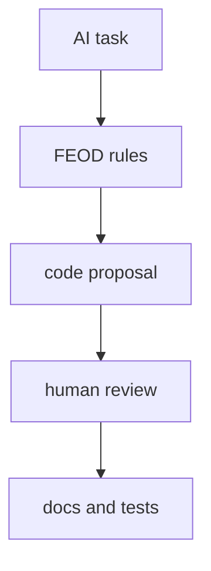

# AI rules

AI rules помогают ассистентам генерировать и ревьюить код в границах FEOD. Они не являются источником методологии и должны ссылаться на нормативные страницы.



## Когда использовать

Используйте AI rules, если команда применяет AI-ассистентов для:

- генерации модулей;
- code review;
- миграции импортов;
- написания README модулей;
- поиска code smells.

## Входные данные

Хороший rule set строится из явных источников:

- карта уровней проекта;
- список модулей и их public API;
- матрица импортов;
- локальные исключения;
- правила именования;
- формат README модуля.

Нельзя просить ассистента угадать архитектуру по нескольким файлам, если в проекте уже есть зафиксированный контракт.

## Формат правил

Минимальный набор:

```md
# FEOD rules for this project

- Use `app`, `pages`, `modules`, `common`, `global` as top-level folders.
- Import external modules only through `@/modules/<name>`.
- Do not import files from another module's `ui`, `model`, `api` or `lib`.
- Keep domain-specific code out of `common`.
- Do not create new top-level folders without updating the architecture decision.
```

## Good example

Запрос к ассистенту:

```md
Create a `checkout` module.
Follow FEOD rules:
- root public API in `src/modules/checkout/index.ts`
- no exports from internal API client
- page imports only from `@/modules/checkout`
```

Результат можно проверить по public API и матрице импортов.

## Bad example

```md
Refactor this project to FEOD automatically.
```

Нарушение: задача не задаёт границы, источники правил, допустимые изменения и критерии проверки.

## Валидация результата

После работы AI-ассистента проверьте:

1. Новые файлы лежат на правильных уровнях.
2. Внешние импорты идут через public API.
3. `common` не получил доменный код.
4. `index.ts` не экспортирует внутренние детали.
5. README модуля не противоречит фактическому public API.

## Что нельзя поручать без review

- автоматическое принятие новых исключений из матрицы импортов;
- расширение public API модуля без потребителя;
- перенос доменной логики в `common`;
- массовую миграцию legacy без baseline и тестов.

## Связанные страницы

- [Матрица импортов](../reference/import-matrix.md)
- [Контракт модуля](../reference/module-contract.md)
- [Code smells](../reference/code-smells.md)
- [Как писать README модуля](../guides/module-readme.md)
