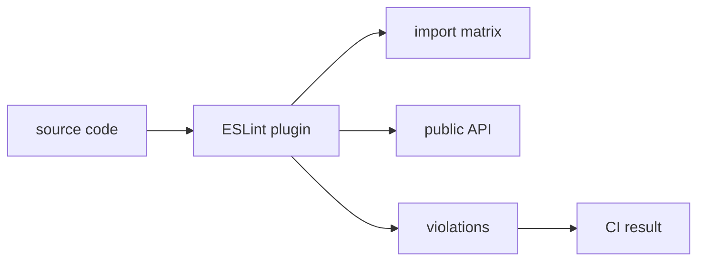

# ESLint plugin

Страница описывает сценарий ESLint plugin для FEOD. Инструмент должен проверять уже принятые правила, а не заменять архитектурное решение команды.



## Когда подключать

Подключайте ESLint plugin после того, как проект зафиксировал:

- верхние уровни `app`, `pages`, `modules`, `common`, `global`;
- public API модулей через `index.ts`;
- правила внешних импортов;
- допустимые локальные исключения.

Если эти правила ещё спорные, сначала согласуйте их в документации проекта или README.

## Что проверять

Минимальный набор правил:

| Проверка | Нарушение | Связанное правило |
| --- | --- | --- |
| Запрет deep imports | `@/modules/cart/model/cart-store` | [Public API](../reference/public-api.md) |
| Направление импортов уровней | `modules` импортирует `pages` | [Матрица импортов](../reference/import-matrix.md) |
| Запрет прямого импорта `global` | `import '@/global/styles'` из модуля | [Global](../structure/global.md) |
| Запрет доменного `common` | `common/cart/helpers` | [Common](../structure/common.md) |
| Контроль public API | `export *` из внутренностей модуля | [Code smells](../reference/code-smells.md) |

## Good example

```ts
// pages/cart/ui/cart-page.tsx
import { CartSummary } from '@/modules/cart';
import { Button } from '@/common/ui/button';
```

Импорт идёт через public API модуля и нейтральный common primitive.

## Bad example

```ts
// pages/cart/ui/cart-page.tsx
import { cartStore } from '@/modules/cart/model/cart-store';
```

Нарушение: страница обходит public API модуля `cart`.

## Что не покрывает линтер

Линтер не может надёжно решить:

- правильно ли названа продуктовая ответственность;
- достаточно ли маленький public API;
- нужен ли код в `common` по смыслу, если имя нейтральное;
- является ли исключение оправданным для конкретного проекта.

Эти решения остаются в review и проектной документации.

## CI flow

Минимальный поток:

1. Локально проверять новые импорты перед commit.
2. В CI блокировать новые нарушения.
3. Для legacy-проекта хранить baseline или список временных исключений.
4. Удалять исключения после перевода потребителей на public API.

## Чеклист внедрения

- Правила FEOD уже описаны в проекте.
- Линтер блокирует новые deep imports.
- Legacy-исключения имеют владельца и причину.
- CI показывает понятное сообщение с ссылкой на reference.
- Исключения не становятся постоянным способом обхода архитектуры.

## Связанные страницы

- [Матрица импортов](../reference/import-matrix.md)
- [Public API](../reference/public-api.md)
- [Code review checklist](../guides/code-review.md)
- [FEOD config](./feod-config.md)
