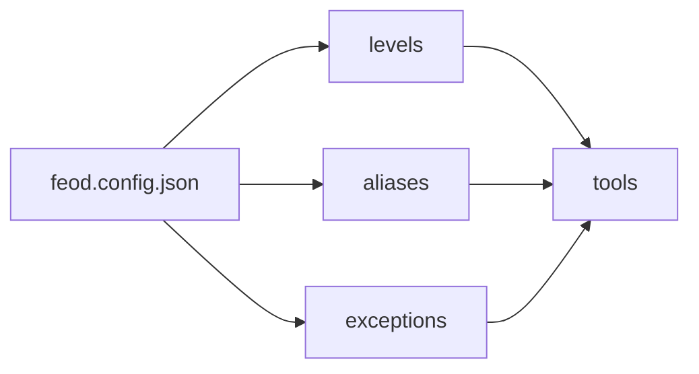

# FEOD config

FEOD config фиксирует машинно-читаемую конфигурацию методологии для линтера, AI rules и внутренних проверок проекта.



## Когда использовать

Config нужен, когда команда хочет проверять правила автоматически или передавать их инструментам без ручного пересказа.

Для маленького проекта достаточно README и reference-страниц. Config становится полезным, когда появляются исключения, кастомные aliases или несколько приложений.

## Минимальная схема

```json
{
  "root": "src",
  "levels": ["app", "pages", "modules", "common", "global"],
  "modulePublicApi": "index.ts",
  "aliases": {
    "@": "src"
  }
}
```

## Расширенная схема

```json
{
  "root": "src",
  "levels": ["app", "pages", "modules", "common", "global"],
  "modulePublicApi": "index.ts",
  "aliases": {
    "@": "src"
  },
  "rules": {
    "noDeepImports": true,
    "noPagesToModules": true,
    "noDomainCommon": true,
    "noGlobalImports": true
  },
  "exceptions": [
    {
      "rule": "noDeepImports",
      "from": "src/pages/legacy/**",
      "to": "src/modules/legacy/**",
      "reason": "Temporary migration baseline"
    }
  ]
}
```

## Поля

| Поле | Обязательное | Значение |
| --- | --- | --- |
| `root` | да | Корень исходного кода |
| `levels` | да | Канонические верхние уровни FEOD |
| `modulePublicApi` | да | Имя файла public API модуля |
| `aliases` | нет | Алиасы импортов проекта |
| `rules` | нет | Включённые автоматические проверки |
| `exceptions` | нет | Явные временные исключения |

## Good example

```json
{
  "root": "src",
  "levels": ["app", "pages", "modules", "common", "global"],
  "modulePublicApi": "index.ts"
}
```

Config отражает canonical FEOD без лишних отклонений.

## Bad example

```json
{
  "root": "src",
  "levels": ["app", "pages", "widgets", "shared", "misc"],
  "modulePublicApi": "*"
}
```

Нарушение: config смешивает FEOD с другой структурой и отключает явный public API.

## Правила для исключений

Исключение должно иметь:

- правило, которое оно нарушает;
- область действия;
- причину;
- владельца или процесс удаления, если проект это требует.

Исключение без причины считается скрытым изменением методологии.

## Связанные страницы

- [ESLint plugin](./eslint-plugin.md)
- [AI rules](./ai-rules.md)
- [Матрица импортов](../reference/import-matrix.md)
- [Правила именования](../reference/naming.md)
