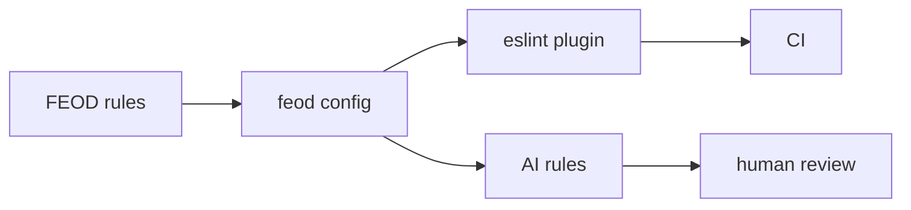

# Tools

Tools помогают применять FEOD в проекте, но не заменяют понимание методологии. Сначала команда фиксирует структуру, уровни, public API и правила импортов; затем подключает инструменты, чтобы поддерживать эти решения в коде и ревью.

## Что входит в первый этап

В первом этапе документация описывает только три направления.

| Инструмент | Зачем нужен | Статус описания |
| --- | --- | --- |
| [ESLint plugin](./eslint-plugin.md) | Проверять архитектурные нарушения: обход public API, обратные зависимости, deep imports. | Сценарий внедрения, проверки и CI flow. |
| [AI rules](./ai-rules.md) | Давать AI-ассистентам правила структуры проекта, ревью и генерации кода. | Набор правил, входные данные и валидация результата. |
| [FEOD config](./feod-config.md) | Фиксировать конфигурацию уровней, модулей и допустимых отклонений. | Контракт для линтера, AI rules и внутренних проверок. |

## Как писать страницы Tools

Каждая страница Tools отвечает на практические вопросы:

1. Когда инструмент подключать.
2. Какие входные данные ему нужны.
3. Что он проверяет или генерирует.
4. Какие ошибки он не покрывает.
5. Как команда валидирует результат.

## Что нельзя обещать

Нельзя писать о будущем инструменте как о готовом продукте. Если техническая реализация не подтверждена, страница должна прямо говорить, что это roadmap или продуктовый сценарий.

Инструмент не является источником правил. Источник правил - разделы `Reference`, `Structure` и `Core Concepts`.

## Связанные разделы

- [Матрица импортов](../reference/import-matrix.md)
- [Public API](../reference/public-api.md)
- [Code smells](../reference/code-smells.md)
- [Правила именования](../reference/naming.md)
- [Code review checklist](../guides/code-review.md)
