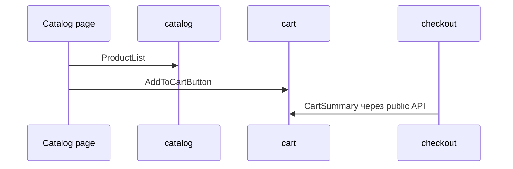

# Разбор e-commerce проекта

Этот tutorial проходит по связному e-commerce сценарию и показывает, как FEOD распределяет каталог, корзину, оформление заказа и пользовательские данные.



## Когда использовать

Используйте страницу после базового знакомства с уровнями FEOD. Это не справочник всех правил, а последовательный разбор одного проекта.

## Входные условия

- Читатель знает уровни `app`, `pages`, `modules`, `common`, `global`.
- Читатель понимает роль public API.
- В проекте есть несколько связанных продуктовых сценариев.

## Шаги

1. Опишите пользовательские сценарии.

   ```text
   - пользователь смотрит каталог
   - добавляет товар в корзину
   - переходит к оформлению заказа
   - использует данные профиля при оформлении
   ```

2. Выделите модули по ответственности.

   ```text
   catalog   # товары, фильтры, карточки
   cart      # содержимое корзины
   checkout  # оформление заказа
   user      # пользовательские данные
   ```

3. Разложите route-level экраны в `pages`.

   ```text
   pages/
     catalog/
     cart/
     checkout/
   ```

4. Откройте public API модулей.

   ```ts
   // modules/catalog/index.ts
   export { ProductGrid } from './ui/product-grid';
   export { useProducts } from './model/use-products';
   export type { Product } from './model/types';
   ```

   ```ts
   // modules/cart/index.ts
   export { AddToCartButton } from './ui/add-to-cart-button';
   export { CartSummary } from './ui/cart-summary';
   export { useCart } from './model/use-cart';
   ```

5. Соберите страницы из модулей.

   ```tsx
   // pages/catalog/ui/catalog-page.tsx
   import { ProductGrid } from '@/modules/catalog';

   export function CatalogPage() {
     return <ProductGrid />;
   }
   ```

   ```tsx
   // pages/cart/ui/cart-page.tsx
   import { CartSummary } from '@/modules/cart';
   import { CheckoutStartButton } from '@/modules/checkout';

   export function CartPage() {
     return (
       <main>
         <CartSummary />
         <CheckoutStartButton />
       </main>
     );
   }
   ```

6. Проверьте взаимодействие модулей.

   Модуль `checkout` может использовать public API `cart` и `user`, если оформление заказа действительно зависит от корзины и пользовательских данных.

   ```ts
   // good
   import { useCart } from '@/modules/cart';
   import { useUser } from '@/modules/user';
   ```

   ```ts
   // bad
   import { cartStore } from '@/modules/cart/model/cart-store';
   ```

   Нарушение: `checkout` зависит от внутренней модели `cart`.

7. Оставьте в `common` только нейтральные primitives.

   ```text
   common/ui/button
   common/ui/dialog
   common/lib/format-price
   ```

   `format-price` допустим в `common`, если он не знает о каталоге, корзине или скидках конкретного продукта.

## Итоговая структура

```text
src/
  app/
  pages/
    catalog/
    cart/
    checkout/
  modules/
    catalog/
    cart/
    checkout/
    user/
  common/
    ui/
    lib/
  global/
```

## Чеклист

- Каждый модуль соответствует продуктовой ответственности.
- Страницы собирают сценарии, но не становятся источником общей логики.
- Модули импортируют друг друга только через public API.
- `common` не знает о товарах, корзине и оформлении заказа.
- Внутренние stores и API-клиенты не импортируются извне.

## Типичные ошибки

- Сделать один модуль `shop` для всех сценариев -> изменения каталога, корзины и checkout начинают мешать друг другу.
- Положить `cartStore` в `common` -> доменное состояние становится глобальным shared.
- Использовать страницу `cart` как источник логики для checkout -> `pages` превращается в переиспользуемый слой.
- Экспортировать все внутренние типы каталога -> public API перестаёт быть управляемым.

## Связанные страницы

- [E-commerce example](../examples/ecommerce.md)
- [Матрица импортов](../reference/import-matrix.md)
- [Code smells](../reference/code-smells.md)
- [Как не превратить common в свалку](../guides/common-boundaries.md)
