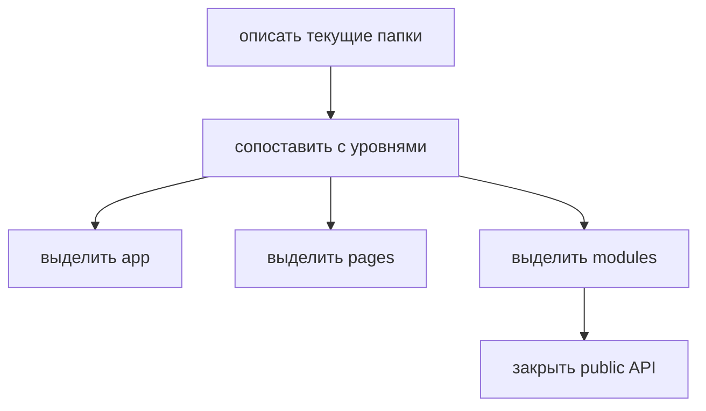

# Существующий проект

Этот tutorial показывает безопасный первый проход по существующему проекту: найти уровни FEOD, не переписывая всё сразу.



## Когда использовать

Используйте этот сценарий, если проект уже живёт в произвольной структуре и нужно постепенно привести его к FEOD.

## Входные условия

- Есть текущая структура `src`.
- Команда может выделить основные route-level экраны.
- Известны крупные продуктовые области.
- Есть возможность менять импорты постепенно.

## Шаги

1. Найдите точку сборки приложения.

   Перенесите entrypoint, провайдеры, роутер и верхнеуровневый wiring в `app`.

2. Отделите route-level экраны.

   Экраны, связанные с маршрутами, перенесите в `pages`. Не выносите туда общий UI или модель домена.

3. Составьте список продуктовых областей.

   Хорошие кандидаты в `modules`: `auth`, `profile`, `catalog`, `cart`, `checkout`, `billing`, `notifications`.

4. Выберите один модуль для первого прохода.

   Не начинайте с самого связанного legacy-участка. Первый модуль должен дать понятный образец для команды.

5. Создайте public API.

   Добавьте корневой `index.ts` и переведите ближайших потребителей на импорт через него.

6. Зафиксируйте временные нарушения.

   Legacy deep imports лучше пометить как долг, чем маскировать их новым фасадом без понимания контракта.

7. Разберите `shared`, `utils` или `common`.

   Нейтральные primitives оставьте в `common`. Доменный код перенесите в соответствующие модули.

## Итоговая структура

```text
src/
  app/
  pages/
  modules/
    auth/
    profile/
  common/
  global/
```

На первом проходе структура может быть неполной. Важнее получить работающие границы и понятный порядок миграции.

## Чеклист

- Entry-point и провайдеры отделены от бизнесовых сценариев.
- Route-level экраны не используются как источник shared-логики.
- Есть хотя бы один модуль с public API.
- Новые импорты идут через public API.
- Legacy deep imports видны как технический долг.
- `common` проверен на доменные утечки.

## Типичные ошибки

- Переименовать папки без изменения импортов -> архитектура выглядит новой, но зависимости остаются прежними.
- Мигрировать весь проект одним PR -> review перестаёт видеть смысл изменений.
- Создать фасад, который экспортирует всё подряд -> public API не появляется.
- Перетащить все helpers в `common` -> проблема общей свалки сохраняется.

## Связанные страницы

- [Миграция пошагово](./migration-step-by-step.md)
- [Миграция с обычной модульной архитектуры](../guides/migration-from-modular.md)
- [Code smells](../reference/code-smells.md)
- [Code review checklist](../guides/code-review.md)
