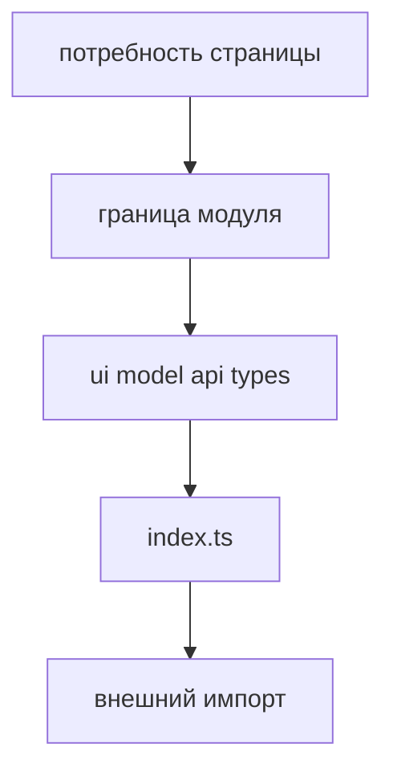

# Первый модуль

Этот tutorial показывает, как спроектировать первый FEOD-модуль и не превратить его в папку компонентов.



## Когда использовать

Используйте страницу при создании первого продуктового модуля в новом или существующем проекте.

## Входные условия

- Есть продуктовая ответственность.
- Известны первые потребители модуля.
- Понятно, какие части должны быть доступны снаружи.
- Есть решение, что модуль живёт на уровне `modules`.

## Шаги

1. Назовите ответственность.

   ```text
   checkout - оформление заказа
   notifications - уведомления пользователя
   catalog - просмотр и фильтрация товаров
   ```

   Название `components` или `services` не подходит: оно описывает тип файлов, а не продуктовую область.

2. Опишите потребителей.

   ```text
   checkout:
   - используется страницей cart
   - может использовать cart public API
   - не импортируется из common
   ```

3. Создайте минимальную структуру.

   ```text
   src/modules/checkout/
     ui/
       checkout-form.tsx
     model/
       use-checkout.ts
     index.ts
   ```

4. Спрячьте внутренние детали.

   ```ts
   // src/modules/checkout/model/use-checkout.ts
   import { submitOrder } from '../api/submit-order';

   export function useCheckout() {
     return { submitOrder };
   }
   ```

   `api/submit-order` остаётся внутренним файлом, если внешним потребителям не нужен прямой вызов.

5. Откройте public API.

   ```ts
   // src/modules/checkout/index.ts
   export { CheckoutForm } from './ui/checkout-form';
   export { useCheckout } from './model/use-checkout';
   ```

6. Проверьте внешний импорт.

   ```ts
   // good
   import { CheckoutForm } from '@/modules/checkout';

   // bad
   import { CheckoutForm } from '@/modules/checkout/ui/checkout-form';
   ```

7. Добавьте README, если модуль не очевиден.

   README нужен, когда у модуля есть несколько потребителей, ограничения зависимостей, подмодули или нетривиальный public API.

## Итоговая структура

```text
src/modules/checkout/
  ui/
    checkout-form.tsx
  model/
    use-checkout.ts
  api/
    submit-order.ts
  README.md
  index.ts
```

## Чеклист

- Название модуля описывает продуктовую ответственность.
- У модуля есть корневой `index.ts`.
- Внешние потребители используют только public API.
- Внутренний API-клиент не экспортирован без необходимости.
- README объясняет ответственность, если она не очевидна.
- Модуль не содержит чужие сценарии.

## Типичные ошибки

- Начать с директорий `components`, `hooks`, `api` на уровне `modules` -> продуктовая граница не появляется.
- Экспортировать внутренний API-запрос наружу -> потребители обходят сценарий модуля.
- Смешать `checkout` и `cart` в одном модуле без причины -> ответственность становится размытой.
- Не описать потребителей -> public API формируется случайно.

## Связанные страницы

- [Как проектировать модуль](../guides/design-module.md)
- [Контракт модуля](../reference/module-contract.md)
- [Public API](../reference/public-api.md)
- [Как писать README модуля](../guides/module-readme.md)
