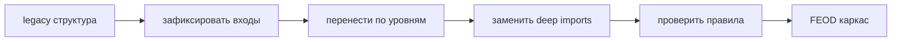

# Миграция пошагово

Этот tutorial задаёт порядок миграции к FEOD, когда проект нельзя остановить ради полной перестройки.



## Когда использовать

Используйте сценарий для долгоживущего проекта, где нужно вводить FEOD поэтапно и сохранять поставку продуктовых задач.

## Входные условия

- Есть список основных страниц или маршрутов.
- Есть список текущих доменных или продуктовых областей.
- Команда готова запрещать новые deep imports.
- Есть владелец миграционного решения.

## Шаги

1. Зафиксируйте целевую карту уровней.

   ```text
   app -> pages -> modules -> common
   global используется без прямых импортов
   ```

2. Введите правило для нового кода.

   Новый код не должен добавлять deep imports в чужие модули. Даже если legacy ещё нарушает правило, новые нарушения нужно останавливать.

3. Выделите `app`.

   Перенесите entrypoint, роутер, провайдеры, глобальные стили и wiring. Не переносите туда бизнес-логику.

4. Выделите `pages`.

   Route-level компоненты становятся страницами. Их задача - собрать сценарий из модулей.

5. Выберите первый модуль.

   Начните с области, где есть явные потребители и понятная ответственность.

6. Соберите public API первого модуля.

   ```ts
   // src/modules/catalog/index.ts
   export { ProductGrid } from './ui/product-grid';
   export { useProducts } from './model/use-products';
   export type { Product } from './model/types';
   ```

7. Переведите потребителей на public API.

   ```ts
   // good
   import { ProductGrid } from '@/modules/catalog';

   // bad
   import { ProductGrid } from '@/modules/catalog/ui/product-grid';
   ```

8. Повторите для следующих модулей.

   После каждого модуля проверяйте, не появился ли общий код, который ошибочно ушёл в `common`.

9. Подключайте tooling после стабилизации правил.

   Линтер и AI rules полезны, когда команда уже согласовала базовые контракты. Иначе инструмент начнёт закреплять случайные решения.

## Итоговая структура

```text
src/
  app/
  pages/
  modules/
    catalog/
    cart/
    checkout/
  common/
  global/
```

## Чеклист

- Для нового кода запрещены deep imports.
- `app` не содержит доменную логику.
- `pages` не экспортируют reusable business logic.
- Каждый перенесённый модуль имеет `index.ts`.
- Legacy-нарушения видны и имеют порядок исправления.
- Tooling подключается к уже согласованным правилам.

## Типичные ошибки

- Сначала писать lint rules, а потом решать границы -> инструмент закрепляет хаос.
- Смешать migration PR с продуктовой задачей -> review не может отделить поведение от структуры.
- Сделать `common` промежуточным складом миграции -> долг становится новым стандартом.
- Удалять все внутренние пути до перевода потребителей -> миграция ломает сборку без архитектурной пользы.

## Связанные страницы

- [Существующий проект](./existing-project.md)
- [Миграция с FSD](../guides/migration-from-fsd.md)
- [Миграция с обычной модульной архитектуры](../guides/migration-from-modular.md)
- [ESLint plugin](../tools/eslint-plugin.md)
