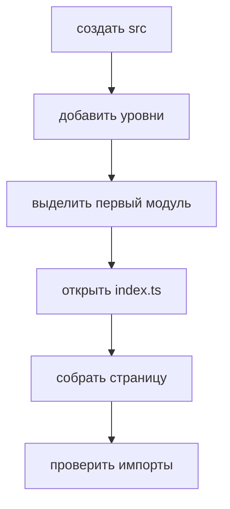

# Новый проект

Этот tutorial показывает, как начать новый frontend-проект с FEOD без лишних уровней и преждевременных абстракций.



## Когда использовать

Используйте этот сценарий, если проект создаётся с нуля и команда уже решила держать продуктовые области в `modules`.

## Входные условия

- Есть выбранный frontend stack.
- Есть хотя бы один route-level экран.
- Известны первые продуктовые сценарии.
- Команда готова импортировать модули только через public API.

## Шаги

1. Создайте базовые уровни.

   ```text
   src/
     app/
     pages/
     modules/
     common/
     global/
   ```

2. Поместите bootstrap в `app`.

   ```text
   src/app/
     providers/
     router/
     index.ts
   ```

   `app` может знать о страницах, провайдерах и интеграциях приложения. Он не хранит бизнес-логику конкретного сценария.

3. Создайте первую страницу в `pages`.

   ```text
   src/pages/home/
     ui/
       home-page.tsx
     index.ts
   ```

   Страница собирает пользовательский экран и импортирует модули через public API.

4. Выделите первый модуль по ответственности.

   ```text
   src/modules/profile/
     ui/
       profile-card.tsx
     model/
       use-profile.ts
     index.ts
   ```

   Название модуля должно описывать продуктовую область, а не технический тип файла.

5. Откройте только поддерживаемый public API.

   ```ts
   // src/modules/profile/index.ts
   export { ProfileCard } from './ui/profile-card';
   export { useProfile } from './model/use-profile';
   ```

6. Добавляйте `common` только после проверки на нейтральность.

   ```text
   src/common/ui/button/
     button.tsx
     index.ts
   ```

   Если код знает о `profile`, `cart`, `checkout` или другой продуктовой области, он не должен жить в `common`.

7. Используйте `global` только для глобальных деклараций и side effects.

   ```text
   src/global/
     env.d.ts
     styles/
       index.css
   ```

## Итоговая структура

```text
src/
  app/
    providers/
    router/
    index.ts
  pages/
    home/
      ui/
        home-page.tsx
      index.ts
  modules/
    profile/
      ui/
        profile-card.tsx
      model/
        use-profile.ts
      index.ts
  common/
    ui/
      button/
        button.tsx
        index.ts
  global/
    env.d.ts
    styles/
      index.css
```

## Чеклист

- В проекте есть пять верхних уровней FEOD.
- Bootstrap находится в `app`.
- Route-level экраны находятся в `pages`.
- Первый продуктовый сценарий оформлен как модуль.
- Модуль имеет корневой `index.ts`.
- `common` не содержит доменную логику.
- `global` не используется как импортируемый shared.

## Типичные ошибки

- Создать пустые модули на будущее -> структура начинает отражать ожидания, а не реальные ответственности.
- Назвать модуль технически: `components`, `hooks`, `services` -> модуль перестаёт быть продуктовой границей.
- Положить API конкретного сценария в `common` -> общий уровень становится скрытым доменным слоем.
- Экспортировать всё из модуля через `export *` -> public API перестаёт быть контрактом.

## Связанные страницы

- [Быстрый старт](../get-started/quick-start.md)
- [Первый модуль](./first-module.md)
- [Матрица импортов](../reference/import-matrix.md)
- [Контракт модуля](../reference/module-contract.md)
